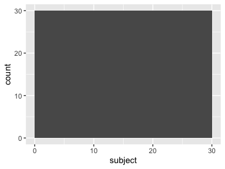
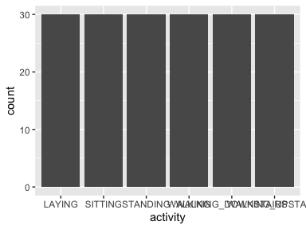

Data report overview
====================

The dataset examined has the following dimensions:

<table style="width:47%;">
<colgroup>
<col style="width: 34%" />
<col style="width: 12%" />
</colgroup>
<thead>
<tr class="header">
<th style="text-align: left;">Feature</th>
<th style="text-align: right;">Result</th>
</tr>
</thead>
<tbody>
<tr class="odd">
<td style="text-align: left;">Number of observations</td>
<td style="text-align: right;">180</td>
</tr>
<tr class="even">
<td style="text-align: left;">Number of variables</td>
<td style="text-align: right;">68</td>
</tr>
</tbody>
</table>

Codebook summary table
======================

<table style="width:100%;">
<colgroup>
<col style="width: 8%" />
<col style="width: 40%" />
<col style="width: 11%" />
<col style="width: 12%" />
<col style="width: 11%" />
<col style="width: 15%" />
</colgroup>
<thead>
<tr class="header">
<th style="text-align: left;">Label</th>
<th style="text-align: left;">Variable</th>
<th style="text-align: left;">Class</th>
<th style="text-align: right;"># unique values</th>
<th style="text-align: center;">Missing</th>
<th style="text-align: left;">Description</th>
</tr>
</thead>
<tbody>
<tr class="odd">
<td style="text-align: left;"></td>
<td style="text-align: left;"><strong><a href="#subject">subject</a></strong></td>
<td style="text-align: left;">integer</td>
<td style="text-align: right;">30</td>
<td style="text-align: center;">0.00 %</td>
<td style="text-align: left;">A group of 30 volunteers within an age bracket of 19-48 years old</td>
</tr>
<tr class="even">
<td style="text-align: left;"></td>
<td style="text-align: left;"><strong><a href="#activity">activity</a></strong></td>
<td style="text-align: left;">factor</td>
<td style="text-align: right;">6</td>
<td style="text-align: center;">0.00 %</td>
<td style="text-align: left;">Activities wearing a smartphone (Samsung Galaxy S II) on the waist</td>
</tr>
<tr class="odd">
<td style="text-align: left;"></td>
<td style="text-align: left;"><strong><a href="#tbodyacc-mean-x">tBodyAcc-mean()-X</a></strong></td>
<td style="text-align: left;">numeric</td>
<td style="text-align: right;">180</td>
<td style="text-align: center;">0.00 %</td>
<td style="text-align: left;">Average of body acceleration signal in terms of mean in X direction using accelerometer</td>
</tr>
<tr class="even">
<td style="text-align: left;"></td>
<td style="text-align: left;"><strong><a href="#tbodyacc-mean-y">tBodyAcc-mean()-Y</a></strong></td>
<td style="text-align: left;">numeric</td>
<td style="text-align: right;">180</td>
<td style="text-align: center;">0.00 %</td>
<td style="text-align: left;">Average of body acceleration signal in terms of mean in Y direction using accelerometer</td>
</tr>
<tr class="odd">
<td style="text-align: left;"></td>
<td style="text-align: left;"><strong><a href="#tbodyacc-mean-z">tBodyAcc-mean()-Z</a></strong></td>
<td style="text-align: left;">numeric</td>
<td style="text-align: right;">180</td>
<td style="text-align: center;">0.00 %</td>
<td style="text-align: left;">Average of body acceleration signal in terms of mean in Z direction using accelerometer</td>
</tr>
<tr class="even">
<td style="text-align: left;"></td>
<td style="text-align: left;"><strong><a href="#tbodyacc-std-x">tBodyAcc-std()-X</a></strong></td>
<td style="text-align: left;">numeric</td>
<td style="text-align: right;">180</td>
<td style="text-align: center;">0.00 %</td>
<td style="text-align: left;">Average of body acceleration signal in terms of standard deviation in X direction using accelerometer</td>
</tr>
<tr class="odd">
<td style="text-align: left;"></td>
<td style="text-align: left;"><strong><a href="#tbodyacc-std-y">tBodyAcc-std()-Y</a></strong></td>
<td style="text-align: left;">numeric</td>
<td style="text-align: right;">180</td>
<td style="text-align: center;">0.00 %</td>
<td style="text-align: left;">Average of body acceleration signal in terms of standard deviation in Y direction using accelerometer</td>
</tr>
<tr class="even">
<td style="text-align: left;"></td>
<td style="text-align: left;"><strong><a href="#tbodyacc-std-z">tBodyAcc-std()-Z</a></strong></td>
<td style="text-align: left;">numeric</td>
<td style="text-align: right;">180</td>
<td style="text-align: center;">0.00 %</td>
<td style="text-align: left;">Average of body acceleration signal in terms of standard deviation in Z direction using accelerometer</td>
</tr>
<tr class="odd">
<td style="text-align: left;"></td>
<td style="text-align: left;"><strong><a href="#tgravityacc-mean-x">tGravityAcc-mean()-X</a></strong></td>
<td style="text-align: left;">numeric</td>
<td style="text-align: right;">180</td>
<td style="text-align: center;">0.00 %</td>
<td style="text-align: left;">Average of gravity acceleration signal in terms of mean in X direction using accelerometer</td>
</tr>
<tr class="even">
<td style="text-align: left;"></td>
<td style="text-align: left;"><strong><a href="#tgravityacc-mean-y">tGravityAcc-mean()-Y</a></strong></td>
<td style="text-align: left;">numeric</td>
<td style="text-align: right;">180</td>
<td style="text-align: center;">0.00 %</td>
<td style="text-align: left;">Average of gravity acceleration signal in terms of mean in Y direction using accelerometer</td>
</tr>
<tr class="odd">
<td style="text-align: left;"></td>
<td style="text-align: left;"><strong><a href="#tgravityacc-mean-z">tGravityAcc-mean()-Z</a></strong></td>
<td style="text-align: left;">numeric</td>
<td style="text-align: right;">180</td>
<td style="text-align: center;">0.00 %</td>
<td style="text-align: left;">Average of gravity acceleration signal in terms of mean in Z direction using accelerometer</td>
</tr>
<tr class="even">
<td style="text-align: left;"></td>
<td style="text-align: left;"><strong><a href="#tgravityacc-std-x">tGravityAcc-std()-X</a></strong></td>
<td style="text-align: left;">numeric</td>
<td style="text-align: right;">180</td>
<td style="text-align: center;">0.00 %</td>
<td style="text-align: left;">Average of gravity acceleration signal in terms of standard deviation in X direction using accelerometer</td>
</tr>
<tr class="odd">
<td style="text-align: left;"></td>
<td style="text-align: left;"><strong><a href="#tgravityacc-std-y">tGravityAcc-std()-Y</a></strong></td>
<td style="text-align: left;">numeric</td>
<td style="text-align: right;">180</td>
<td style="text-align: center;">0.00 %</td>
<td style="text-align: left;">Average of gravity acceleration signal in terms of standard deviation in Y direction using accelerometer</td>
</tr>
<tr class="even">
<td style="text-align: left;"></td>
<td style="text-align: left;"><strong><a href="#tgravityacc-std-z">tGravityAcc-std()-Z</a></strong></td>
<td style="text-align: left;">numeric</td>
<td style="text-align: right;">180</td>
<td style="text-align: center;">0.00 %</td>
<td style="text-align: left;">Average of gravity acceleration signal in terms of standard deviation in Z direction using accelerometer</td>
</tr>
<tr class="odd">
<td style="text-align: left;"></td>
<td style="text-align: left;"><strong><a href="#tbodyaccjerk-mean-x">tBodyAccJerk-mean()-X</a></strong></td>
<td style="text-align: left;">numeric</td>
<td style="text-align: right;">180</td>
<td style="text-align: center;">0.00 %</td>
<td style="text-align: left;">Average of body acceleration Jerk signals in term of mean in X direction using accelerometer</td>
</tr>
<tr class="even">
<td style="text-align: left;"></td>
<td style="text-align: left;"><strong><a href="#tbodyaccjerk-mean-y">tBodyAccJerk-mean()-Y</a></strong></td>
<td style="text-align: left;">numeric</td>
<td style="text-align: right;">180</td>
<td style="text-align: center;">0.00 %</td>
<td style="text-align: left;">Average of body acceleration Jerk signals in term of mean in Y direction using accelerometer</td>
</tr>
<tr class="odd">
<td style="text-align: left;"></td>
<td style="text-align: left;"><strong><a href="#tbodyaccjerk-mean-z">tBodyAccJerk-mean()-Z</a></strong></td>
<td style="text-align: left;">numeric</td>
<td style="text-align: right;">180</td>
<td style="text-align: center;">0.00 %</td>
<td style="text-align: left;">Average of body acceleration Jerk signals in term of mean in Z direction using accelerometer</td>
</tr>
<tr class="even">
<td style="text-align: left;"></td>
<td style="text-align: left;"><strong><a href="#tbodyaccjerk-std-x">tBodyAccJerk-std()-X</a></strong></td>
<td style="text-align: left;">numeric</td>
<td style="text-align: right;">180</td>
<td style="text-align: center;">0.00 %</td>
<td style="text-align: left;">Average of body acceleration Jerk signals in term of standard deviation in X direction using accelerometer</td>
</tr>
<tr class="odd">
<td style="text-align: left;"></td>
<td style="text-align: left;"><strong><a href="#tbodyaccjerk-std-y">tBodyAccJerk-std()-Y</a></strong></td>
<td style="text-align: left;">numeric</td>
<td style="text-align: right;">180</td>
<td style="text-align: center;">0.00 %</td>
<td style="text-align: left;">Average of body acceleration Jerk signals in term of standard deviation in Y direction using accelerometer</td>
</tr>
<tr class="even">
<td style="text-align: left;"></td>
<td style="text-align: left;"><strong><a href="#tbodyaccjerk-std-z">tBodyAccJerk-std()-Z</a></strong></td>
<td style="text-align: left;">numeric</td>
<td style="text-align: right;">180</td>
<td style="text-align: center;">0.00 %</td>
<td style="text-align: left;">Average of body acceleration Jerk signals in term of standard deviation in Z direction using accelerometer</td>
</tr>
<tr class="odd">
<td style="text-align: left;"></td>
<td style="text-align: left;"><strong><a href="#tbodygyro-mean-x">tBodyGyro-mean()-X</a></strong></td>
<td style="text-align: left;">numeric</td>
<td style="text-align: right;">180</td>
<td style="text-align: center;">0.00 %</td>
<td style="text-align: left;">Average of body acceleration signals in term of mean in X direction using gyroscope</td>
</tr>
<tr class="even">
<td style="text-align: left;"></td>
<td style="text-align: left;"><strong><a href="#tbodygyro-mean-y">tBodyGyro-mean()-Y</a></strong></td>
<td style="text-align: left;">numeric</td>
<td style="text-align: right;">180</td>
<td style="text-align: center;">0.00 %</td>
<td style="text-align: left;">Average of body acceleration signals in term of mean in Y direction using gyroscope</td>
</tr>
<tr class="odd">
<td style="text-align: left;"></td>
<td style="text-align: left;"><strong><a href="#tbodygyro-mean-z">tBodyGyro-mean()-Z</a></strong></td>
<td style="text-align: left;">numeric</td>
<td style="text-align: right;">180</td>
<td style="text-align: center;">0.00 %</td>
<td style="text-align: left;">Average of body acceleration signals in term of mean in Z direction using gyroscope</td>
</tr>
<tr class="even">
<td style="text-align: left;"></td>
<td style="text-align: left;"><strong><a href="#tbodygyro-std-x">tBodyGyro-std()-X</a></strong></td>
<td style="text-align: left;">numeric</td>
<td style="text-align: right;">180</td>
<td style="text-align: center;">0.00 %</td>
<td style="text-align: left;">Average of body acceleration signals in term of standard deviation in X direction using gyroscope</td>
</tr>
<tr class="odd">
<td style="text-align: left;"></td>
<td style="text-align: left;"><strong><a href="#tbodygyro-std-y">tBodyGyro-std()-Y</a></strong></td>
<td style="text-align: left;">numeric</td>
<td style="text-align: right;">180</td>
<td style="text-align: center;">0.00 %</td>
<td style="text-align: left;">Average of body acceleration signals in term of standard deviation in Y direction using gyroscope</td>
</tr>
<tr class="even">
<td style="text-align: left;"></td>
<td style="text-align: left;"><strong><a href="#tbodygyro-std-z">tBodyGyro-std()-Z</a></strong></td>
<td style="text-align: left;">numeric</td>
<td style="text-align: right;">180</td>
<td style="text-align: center;">0.00 %</td>
<td style="text-align: left;">Average of body acceleration signals in term of standard deviation in Z direction using gyroscope</td>
</tr>
<tr class="odd">
<td style="text-align: left;"></td>
<td style="text-align: left;"><strong><a href="#tbodygyrojerk-mean-x">tBodyGyroJerk-mean()-X</a></strong></td>
<td style="text-align: left;">numeric</td>
<td style="text-align: right;">180</td>
<td style="text-align: center;">0.00 %</td>
<td style="text-align: left;">Average of body acceleration Jerk signals in term of mean in X direction using gyroscope</td>
</tr>
<tr class="even">
<td style="text-align: left;"></td>
<td style="text-align: left;"><strong><a href="#tbodygyrojerk-mean-y">tBodyGyroJerk-mean()-Y</a></strong></td>
<td style="text-align: left;">numeric</td>
<td style="text-align: right;">180</td>
<td style="text-align: center;">0.00 %</td>
<td style="text-align: left;">Average of body acceleration Jerk signals in term of mean in Y direction using gyroscope</td>
</tr>
<tr class="odd">
<td style="text-align: left;"></td>
<td style="text-align: left;"><strong><a href="#tbodygyrojerk-mean-z">tBodyGyroJerk-mean()-Z</a></strong></td>
<td style="text-align: left;">numeric</td>
<td style="text-align: right;">180</td>
<td style="text-align: center;">0.00 %</td>
<td style="text-align: left;">Average of body acceleration Jerk signals in term of mean in Z direction using gyroscope</td>
</tr>
<tr class="even">
<td style="text-align: left;"></td>
<td style="text-align: left;"><strong><a href="#tbodygyrojerk-std-x">tBodyGyroJerk-std()-X</a></strong></td>
<td style="text-align: left;">numeric</td>
<td style="text-align: right;">180</td>
<td style="text-align: center;">0.00 %</td>
<td style="text-align: left;">Average of body acceleration Jerk signals in term of standard deviation in X direction using gyroscope</td>
</tr>
<tr class="odd">
<td style="text-align: left;"></td>
<td style="text-align: left;"><strong><a href="#tbodygyrojerk-std-y">tBodyGyroJerk-std()-Y</a></strong></td>
<td style="text-align: left;">numeric</td>
<td style="text-align: right;">180</td>
<td style="text-align: center;">0.00 %</td>
<td style="text-align: left;">Average of body acceleration Jerk signals in term of standard deviation in Y direction using gyroscope</td>
</tr>
<tr class="even">
<td style="text-align: left;"></td>
<td style="text-align: left;"><strong><a href="#tbodygyrojerk-std-z">tBodyGyroJerk-std()-Z</a></strong></td>
<td style="text-align: left;">numeric</td>
<td style="text-align: right;">180</td>
<td style="text-align: center;">0.00 %</td>
<td style="text-align: left;">Average of body acceleration Jerk signals in term of standard deviation in Z direction using gyroscope</td>
</tr>
<tr class="odd">
<td style="text-align: left;"></td>
<td style="text-align: left;"><strong><a href="#tbodyaccmag-mean">tBodyAccMag-mean()</a></strong></td>
<td style="text-align: left;">numeric</td>
<td style="text-align: right;">180</td>
<td style="text-align: center;">0.00 %</td>
<td style="text-align: left;">Average of body acceleration magnitude signals in term of mean using accelerometer</td>
</tr>
<tr class="even">
<td style="text-align: left;"></td>
<td style="text-align: left;"><strong><a href="#tbodyaccmag-std">tBodyAccMag-std()</a></strong></td>
<td style="text-align: left;">numeric</td>
<td style="text-align: right;">180</td>
<td style="text-align: center;">0.00 %</td>
<td style="text-align: left;">Average of body acceleration magnituede signals after in term of standard deviation using accelerometer</td>
</tr>
<tr class="odd">
<td style="text-align: left;"></td>
<td style="text-align: left;"><strong><a href="#tgravityaccmag-mean">tGravityAccMag-mean()</a></strong></td>
<td style="text-align: left;">numeric</td>
<td style="text-align: right;">180</td>
<td style="text-align: center;">0.00 %</td>
<td style="text-align: left;">Average of gravity acceleration magnitude signals in term of mean using accelerometer</td>
</tr>
<tr class="even">
<td style="text-align: left;"></td>
<td style="text-align: left;"><strong><a href="#tgravityaccmag-std">tGravityAccMag-std()</a></strong></td>
<td style="text-align: left;">numeric</td>
<td style="text-align: right;">180</td>
<td style="text-align: center;">0.00 %</td>
<td style="text-align: left;">Average of body acceleration magnitude signals in term of standard deviation using accelerometer</td>
</tr>
<tr class="odd">
<td style="text-align: left;"></td>
<td style="text-align: left;"><strong><a href="#tbodyaccjerkmag-mean">tBodyAccJerkMag-mean()</a></strong></td>
<td style="text-align: left;">numeric</td>
<td style="text-align: right;">180</td>
<td style="text-align: center;">0.00 %</td>
<td style="text-align: left;">Average of body acceleration Jerk magnitude signals in term of mean using accelerometer</td>
</tr>
<tr class="even">
<td style="text-align: left;"></td>
<td style="text-align: left;"><strong><a href="#tbodyaccjerkmag-std">tBodyAccJerkMag-std()</a></strong></td>
<td style="text-align: left;">numeric</td>
<td style="text-align: right;">180</td>
<td style="text-align: center;">0.00 %</td>
<td style="text-align: left;">Average of body acceleration Jerk magnitude signals in term of standard deviation using accelerometer</td>
</tr>
<tr class="odd">
<td style="text-align: left;"></td>
<td style="text-align: left;"><strong><a href="#tbodygyromag-mean">tBodyGyroMag-mean()</a></strong></td>
<td style="text-align: left;">numeric</td>
<td style="text-align: right;">180</td>
<td style="text-align: center;">0.00 %</td>
<td style="text-align: left;">Average of body acceleration magnitude signals in term of mean using gyroscope</td>
</tr>
<tr class="even">
<td style="text-align: left;"></td>
<td style="text-align: left;"><strong><a href="#tbodygyromag-std">tBodyGyroMag-std()</a></strong></td>
<td style="text-align: left;">numeric</td>
<td style="text-align: right;">180</td>
<td style="text-align: center;">0.00 %</td>
<td style="text-align: left;">Average of body acceleration magnitude signals in term of standard deviation using gyroscope</td>
</tr>
<tr class="odd">
<td style="text-align: left;"></td>
<td style="text-align: left;"><strong><a href="#tbodygyrojerkmag-mean">tBodyGyroJerkMag-mean()</a></strong></td>
<td style="text-align: left;">numeric</td>
<td style="text-align: right;">180</td>
<td style="text-align: center;">0.00 %</td>
<td style="text-align: left;">Average of body acceleration Jerk magnitude signals in term of mean using gyroscope</td>
</tr>
<tr class="even">
<td style="text-align: left;"></td>
<td style="text-align: left;"><strong><a href="#tbodygyrojerkmag-std">tBodyGyroJerkMag-std()</a></strong></td>
<td style="text-align: left;">numeric</td>
<td style="text-align: right;">180</td>
<td style="text-align: center;">0.00 %</td>
<td style="text-align: left;">Average of body acceleration Jerk magnitude signals in term of standard deviation using gyroscope</td>
</tr>
<tr class="odd">
<td style="text-align: left;"></td>
<td style="text-align: left;"><strong><a href="#fbodyacc-mean-x">fBodyAcc-mean()-X</a></strong></td>
<td style="text-align: left;">numeric</td>
<td style="text-align: right;">180</td>
<td style="text-align: center;">0.00 %</td>
<td style="text-align: left;">Average of body acceleration signal after Fast Fourier Transform in terms of mean in X direction using accelerometer</td>
</tr>
<tr class="even">
<td style="text-align: left;"></td>
<td style="text-align: left;"><strong><a href="#fbodyacc-mean-y">fBodyAcc-mean()-Y</a></strong></td>
<td style="text-align: left;">numeric</td>
<td style="text-align: right;">180</td>
<td style="text-align: center;">0.00 %</td>
<td style="text-align: left;">Average of body acceleration signal after Fast Fourier Transform in terms of mean in Y direction using accelerometer</td>
</tr>
<tr class="odd">
<td style="text-align: left;"></td>
<td style="text-align: left;"><strong><a href="#fbodyacc-mean-z">fBodyAcc-mean()-Z</a></strong></td>
<td style="text-align: left;">numeric</td>
<td style="text-align: right;">180</td>
<td style="text-align: center;">0.00 %</td>
<td style="text-align: left;">Average of body acceleration signal after Fast Fourier Transform in terms of mean in Z direction using accelerometer</td>
</tr>
<tr class="even">
<td style="text-align: left;"></td>
<td style="text-align: left;"><strong><a href="#fbodyacc-std-x">fBodyAcc-std()-X</a></strong></td>
<td style="text-align: left;">numeric</td>
<td style="text-align: right;">180</td>
<td style="text-align: center;">0.00 %</td>
<td style="text-align: left;">Average of body acceleration signal after Fast Fourier Transform in terms of standard deviation in X direction using accelerometer</td>
</tr>
<tr class="odd">
<td style="text-align: left;"></td>
<td style="text-align: left;"><strong><a href="#fbodyacc-std-y">fBodyAcc-std()-Y</a></strong></td>
<td style="text-align: left;">numeric</td>
<td style="text-align: right;">180</td>
<td style="text-align: center;">0.00 %</td>
<td style="text-align: left;">Average of body acceleration signal after Fast Fourier Transform in terms of standard deviation in Y direction using accelerometer</td>
</tr>
<tr class="even">
<td style="text-align: left;"></td>
<td style="text-align: left;"><strong><a href="#fbodyacc-std-z">fBodyAcc-std()-Z</a></strong></td>
<td style="text-align: left;">numeric</td>
<td style="text-align: right;">180</td>
<td style="text-align: center;">0.00 %</td>
<td style="text-align: left;">Average of body acceleration signal after Fast Fourier Transform in terms of standard deviation in Z direction using accelerometer</td>
</tr>
<tr class="odd">
<td style="text-align: left;"></td>
<td style="text-align: left;"><strong><a href="#fbodyaccjerk-mean-x">fBodyAccJerk-mean()-X</a></strong></td>
<td style="text-align: left;">numeric</td>
<td style="text-align: right;">180</td>
<td style="text-align: center;">0.00 %</td>
<td style="text-align: left;">Average of body acceleration Jerk signal after Fast Fourier Transform in terms of mean in X direction using accelerometer</td>
</tr>
<tr class="even">
<td style="text-align: left;"></td>
<td style="text-align: left;"><strong><a href="#fbodyaccjerk-mean-y">fBodyAccJerk-mean()-Y</a></strong></td>
<td style="text-align: left;">numeric</td>
<td style="text-align: right;">180</td>
<td style="text-align: center;">0.00 %</td>
<td style="text-align: left;">Average of body acceleration Jerk signal after Fast Fourier Transform in terms of mean in Y direction using accelerometer</td>
</tr>
<tr class="odd">
<td style="text-align: left;"></td>
<td style="text-align: left;"><strong><a href="#fbodyaccjerk-mean-z">fBodyAccJerk-mean()-Z</a></strong></td>
<td style="text-align: left;">numeric</td>
<td style="text-align: right;">180</td>
<td style="text-align: center;">0.00 %</td>
<td style="text-align: left;">Average of body acceleration Jerk signal after Fast Fourier Transform in terms of mean in Z direction using accelerometer</td>
</tr>
<tr class="even">
<td style="text-align: left;"></td>
<td style="text-align: left;"><strong><a href="#fbodyaccjerk-std-x">fBodyAccJerk-std()-X</a></strong></td>
<td style="text-align: left;">numeric</td>
<td style="text-align: right;">180</td>
<td style="text-align: center;">0.00 %</td>
<td style="text-align: left;">Average of body acceleration Jerk signal after Fast Fourier Transform in terms of standard deviation in X direction using accelerometer</td>
</tr>
<tr class="odd">
<td style="text-align: left;"></td>
<td style="text-align: left;"><strong><a href="#fbodyaccjerk-std-y">fBodyAccJerk-std()-Y</a></strong></td>
<td style="text-align: left;">numeric</td>
<td style="text-align: right;">180</td>
<td style="text-align: center;">0.00 %</td>
<td style="text-align: left;">Average of body acceleration Jerk signal after Fast Fourier Transform in terms of standard deviation in Y direction using accelerometer</td>
</tr>
<tr class="even">
<td style="text-align: left;"></td>
<td style="text-align: left;"><strong><a href="#fbodyaccjerk-std-z">fBodyAccJerk-std()-Z</a></strong></td>
<td style="text-align: left;">numeric</td>
<td style="text-align: right;">180</td>
<td style="text-align: center;">0.00 %</td>
<td style="text-align: left;">Average of body acceleration Jerk signal after Fast Fourier Transform in terms of standard deviation in Z direction using accelerometer</td>
</tr>
<tr class="odd">
<td style="text-align: left;"></td>
<td style="text-align: left;"><strong><a href="#fbodygyro-mean-x">fBodyGyro-mean()-X</a></strong></td>
<td style="text-align: left;">numeric</td>
<td style="text-align: right;">180</td>
<td style="text-align: center;">0.00 %</td>
<td style="text-align: left;">Average of body acceleration Jerk signal after Fast Fourier Transform in terms of standard deviation in X direction using accelerometer</td>
</tr>
<tr class="even">
<td style="text-align: left;"></td>
<td style="text-align: left;"><strong><a href="#fbodygyro-mean-y">fBodyGyro-mean()-Y</a></strong></td>
<td style="text-align: left;">numeric</td>
<td style="text-align: right;">180</td>
<td style="text-align: center;">0.00 %</td>
<td style="text-align: left;">Average of body acceleration signal after Fast Fourier Transform in terms of mean in Y direction using accelerometer</td>
</tr>
<tr class="odd">
<td style="text-align: left;"></td>
<td style="text-align: left;"><strong><a href="#fbodygyro-mean-z">fBodyGyro-mean()-Z</a></strong></td>
<td style="text-align: left;">numeric</td>
<td style="text-align: right;">180</td>
<td style="text-align: center;">0.00 %</td>
<td style="text-align: left;">Average of body acceleration signal after Fast Fourier Transform in terms of mean in Z direction using accelerometer</td>
</tr>
<tr class="even">
<td style="text-align: left;"></td>
<td style="text-align: left;"><strong><a href="#fbodygyro-std-x">fBodyGyro-std()-X</a></strong></td>
<td style="text-align: left;">numeric</td>
<td style="text-align: right;">180</td>
<td style="text-align: center;">0.00 %</td>
<td style="text-align: left;">Average of body acceleration signal after Fast Fourier Transform in terms of standard deviation in X direction using accelerometer</td>
</tr>
<tr class="odd">
<td style="text-align: left;"></td>
<td style="text-align: left;"><strong><a href="#fbodygyro-std-y">fBodyGyro-std()-Y</a></strong></td>
<td style="text-align: left;">numeric</td>
<td style="text-align: right;">180</td>
<td style="text-align: center;">0.00 %</td>
<td style="text-align: left;">Average of body acceleration signal after Fast Fourier Transform in terms of standard deviation in Y direction using accelerometer</td>
</tr>
<tr class="even">
<td style="text-align: left;"></td>
<td style="text-align: left;"><strong><a href="#fbodygyro-std-z">fBodyGyro-std()-Z</a></strong></td>
<td style="text-align: left;">numeric</td>
<td style="text-align: right;">180</td>
<td style="text-align: center;">0.00 %</td>
<td style="text-align: left;">Average of body acceleration signal after Fast Fourier Transform in terms of standard deviation in Z direction using accelerometer</td>
</tr>
<tr class="odd">
<td style="text-align: left;"></td>
<td style="text-align: left;"><strong><a href="#fbodyaccmag-mean">fBodyAccMag-mean()</a></strong></td>
<td style="text-align: left;">numeric</td>
<td style="text-align: right;">180</td>
<td style="text-align: center;">0.00 %</td>
<td style="text-align: left;">Average of body acceleration magnitutde signal after Fast Fourier Transform in terms of mean using accelerometer</td>
</tr>
<tr class="even">
<td style="text-align: left;"></td>
<td style="text-align: left;"><strong><a href="#fbodyaccmag-std">fBodyAccMag-std()</a></strong></td>
<td style="text-align: left;">numeric</td>
<td style="text-align: right;">180</td>
<td style="text-align: center;">0.00 %</td>
<td style="text-align: left;">Average of body acceleration magnitutde signal after Fast Fourier Transform in terms of standard deviation using accelerometer</td>
</tr>
<tr class="odd">
<td style="text-align: left;"></td>
<td style="text-align: left;"><strong><a href="#fbodybodyaccjerkmag-mean">fBodyBodyAccJerkMag-mean()</a></strong></td>
<td style="text-align: left;">numeric</td>
<td style="text-align: right;">180</td>
<td style="text-align: center;">0.00 %</td>
<td style="text-align: left;">Average of body acceleration Jerk magnitude signal after Fast Fourier Transform in terms of mean using accelerometer</td>
</tr>
<tr class="even">
<td style="text-align: left;"></td>
<td style="text-align: left;"><strong><a href="#fbodybodyaccjerkmag-std">fBodyBodyAccJerkMag-std()</a></strong></td>
<td style="text-align: left;">numeric</td>
<td style="text-align: right;">180</td>
<td style="text-align: center;">0.00 %</td>
<td style="text-align: left;">Average of body acceleration Jerk magnitude signal after Fast Fourier Transform in terms of standard deviation using accelerometer</td>
</tr>
<tr class="odd">
<td style="text-align: left;"></td>
<td style="text-align: left;"><strong><a href="#fbodybodygyromag-mean">fBodyBodyGyroMag-mean()</a></strong></td>
<td style="text-align: left;">numeric</td>
<td style="text-align: right;">180</td>
<td style="text-align: center;">0.00 %</td>
<td style="text-align: left;">Average of body acceleration Jerk signal after Fast Fourier Transform in terms of mean in using gyroscope</td>
</tr>
<tr class="even">
<td style="text-align: left;"></td>
<td style="text-align: left;"><strong><a href="#fbodybodygyromag-std">fBodyBodyGyroMag-std()</a></strong></td>
<td style="text-align: left;">numeric</td>
<td style="text-align: right;">180</td>
<td style="text-align: center;">0.00 %</td>
<td style="text-align: left;">Average of body acceleration Jerk signal after Fast Fourier Transform in terms of standard deviation in using gyroscope</td>
</tr>
<tr class="odd">
<td style="text-align: left;"></td>
<td style="text-align: left;"><strong><a href="#fbodybodygyrojerkmag-mean">fBodyBodyGyroJerkMag-mean()</a></strong></td>
<td style="text-align: left;">numeric</td>
<td style="text-align: right;">180</td>
<td style="text-align: center;">0.00 %</td>
<td style="text-align: left;">Average of body acceleration Jerk magnitude signal after Fast Fourier Transform in terms of mean in using gyroscope</td>
</tr>
<tr class="even">
<td style="text-align: left;"></td>
<td style="text-align: left;"><strong><a href="#fbodybodygyrojerkmag-std">fBodyBodyGyroJerkMag-std()</a></strong></td>
<td style="text-align: left;">numeric</td>
<td style="text-align: right;">180</td>
<td style="text-align: center;">0.00 %</td>
<td style="text-align: left;">Average of body acceleration Jerk magnitude signal after Fast Fourier Transform in terms of standard deviation in using gyroscope</td>
</tr>
</tbody>
</table>

Variable list
=============

subject
-------

<table style="width:50%;">
<colgroup>
<col style="width: 36%" />
<col style="width: 13%" />
</colgroup>
<thead>
<tr class="header">
<th style="text-align: left;">Feature</th>
<th style="text-align: right;">Result</th>
</tr>
</thead>
<tbody>
<tr class="odd">
<td style="text-align: left;">Variable type</td>
<td style="text-align: right;">integer</td>
</tr>
<tr class="even">
<td style="text-align: left;">Number of missing obs.</td>
<td style="text-align: right;">0 (0 %)</td>
</tr>
<tr class="odd">
<td style="text-align: left;">Number of unique values</td>
<td style="text-align: right;">30</td>
</tr>
<tr class="even">
<td style="text-align: left;">Median</td>
<td style="text-align: right;">15.5</td>
</tr>
<tr class="odd">
<td style="text-align: left;">1st and 3rd quartiles</td>
<td style="text-align: right;">8; 23</td>
</tr>
<tr class="even">
<td style="text-align: left;">Min. and max.</td>
<td style="text-align: right;">1; 30</td>
</tr>
</tbody>
</table>

------------------------------------------------------------------------

activity
--------

<table style="width:51%;">
<colgroup>
<col style="width: 36%" />
<col style="width: 15%" />
</colgroup>
<thead>
<tr class="header">
<th style="text-align: left;">Feature</th>
<th style="text-align: right;">Result</th>
</tr>
</thead>
<tbody>
<tr class="odd">
<td style="text-align: left;">Variable type</td>
<td style="text-align: right;">factor</td>
</tr>
<tr class="even">
<td style="text-align: left;">Number of missing obs.</td>
<td style="text-align: right;">0 (0 %)</td>
</tr>
<tr class="odd">
<td style="text-align: left;">Number of unique values</td>
<td style="text-align: right;">6</td>
</tr>
<tr class="even">
<td style="text-align: left;">Mode</td>
<td style="text-align: right;">“LAYING”</td>
</tr>
<tr class="odd">
<td style="text-align: left;">Reference category</td>
<td style="text-align: right;">LAYING</td>
</tr>
</tbody>
</table>

-   Observed factor levels: "LAYING", "SITTING", "STANDING", "WALKING",
    "WALKING\_DOWNSTAIRS", "WALKING\_UPSTAIRS".

------------------------------------------------------------------------

tBodyAcc-mean()-X
-----------------

<table style="width:54%;">
<colgroup>
<col style="width: 36%" />
<col style="width: 18%" />
</colgroup>
<thead>
<tr class="header">
<th style="text-align: left;">Feature</th>
<th style="text-align: right;">Result</th>
</tr>
</thead>
<tbody>
<tr class="odd">
<td style="text-align: left;">Variable type</td>
<td style="text-align: right;">numeric</td>
</tr>
<tr class="even">
<td style="text-align: left;">Number of missing obs.</td>
<td style="text-align: right;">0 (0 %)</td>
</tr>
<tr class="odd">
<td style="text-align: left;">Number of unique values</td>
<td style="text-align: right;">180</td>
</tr>
<tr class="even">
<td style="text-align: left;">Median</td>
<td style="text-align: right;">0.28</td>
</tr>
<tr class="odd">
<td style="text-align: left;">1st and 3rd quartiles</td>
<td style="text-align: right;">0.27; 0.28</td>
</tr>
<tr class="even">
<td style="text-align: left;">Min. and max.</td>
<td style="text-align: right;">0.22; 0.3</td>
</tr>
</tbody>
</table>

-X-1.png)

------------------------------------------------------------------------

tBodyAcc-mean()-Y
-----------------

<table style="width:57%;">
<colgroup>
<col style="width: 36%" />
<col style="width: 20%" />
</colgroup>
<thead>
<tr class="header">
<th style="text-align: left;">Feature</th>
<th style="text-align: right;">Result</th>
</tr>
</thead>
<tbody>
<tr class="odd">
<td style="text-align: left;">Variable type</td>
<td style="text-align: right;">numeric</td>
</tr>
<tr class="even">
<td style="text-align: left;">Number of missing obs.</td>
<td style="text-align: right;">0 (0 %)</td>
</tr>
<tr class="odd">
<td style="text-align: left;">Number of unique values</td>
<td style="text-align: right;">180</td>
</tr>
<tr class="even">
<td style="text-align: left;">Median</td>
<td style="text-align: right;">-0.02</td>
</tr>
<tr class="odd">
<td style="text-align: left;">1st and 3rd quartiles</td>
<td style="text-align: right;">-0.02; -0.01</td>
</tr>
<tr class="even">
<td style="text-align: left;">Min. and max.</td>
<td style="text-align: right;">-0.04; 0</td>
</tr>
</tbody>
</table>

-Y-1.png)

------------------------------------------------------------------------

tBodyAcc-mean()-Z
-----------------

<table style="width:57%;">
<colgroup>
<col style="width: 36%" />
<col style="width: 20%" />
</colgroup>
<thead>
<tr class="header">
<th style="text-align: left;">Feature</th>
<th style="text-align: right;">Result</th>
</tr>
</thead>
<tbody>
<tr class="odd">
<td style="text-align: left;">Variable type</td>
<td style="text-align: right;">numeric</td>
</tr>
<tr class="even">
<td style="text-align: left;">Number of missing obs.</td>
<td style="text-align: right;">0 (0 %)</td>
</tr>
<tr class="odd">
<td style="text-align: left;">Number of unique values</td>
<td style="text-align: right;">180</td>
</tr>
<tr class="even">
<td style="text-align: left;">Median</td>
<td style="text-align: right;">-0.11</td>
</tr>
<tr class="odd">
<td style="text-align: left;">1st and 3rd quartiles</td>
<td style="text-align: right;">-0.11; -0.1</td>
</tr>
<tr class="even">
<td style="text-align: left;">Min. and max.</td>
<td style="text-align: right;">-0.15; -0.08</td>
</tr>
</tbody>
</table>

-Z-1.png)

------------------------------------------------------------------------

tBodyAcc-std()-X
----------------

<table style="width:56%;">
<colgroup>
<col style="width: 36%" />
<col style="width: 19%" />
</colgroup>
<thead>
<tr class="header">
<th style="text-align: left;">Feature</th>
<th style="text-align: right;">Result</th>
</tr>
</thead>
<tbody>
<tr class="odd">
<td style="text-align: left;">Variable type</td>
<td style="text-align: right;">numeric</td>
</tr>
<tr class="even">
<td style="text-align: left;">Number of missing obs.</td>
<td style="text-align: right;">0 (0 %)</td>
</tr>
<tr class="odd">
<td style="text-align: left;">Number of unique values</td>
<td style="text-align: right;">180</td>
</tr>
<tr class="even">
<td style="text-align: left;">Median</td>
<td style="text-align: right;">-0.75</td>
</tr>
<tr class="odd">
<td style="text-align: left;">1st and 3rd quartiles</td>
<td style="text-align: right;">-0.98; -0.2</td>
</tr>
<tr class="even">
<td style="text-align: left;">Min. and max.</td>
<td style="text-align: right;">-1; 0.63</td>
</tr>
</tbody>
</table>

-X-1.png)

------------------------------------------------------------------------

tBodyAcc-std()-Y
----------------

<table style="width:57%;">
<colgroup>
<col style="width: 36%" />
<col style="width: 20%" />
</colgroup>
<thead>
<tr class="header">
<th style="text-align: left;">Feature</th>
<th style="text-align: right;">Result</th>
</tr>
</thead>
<tbody>
<tr class="odd">
<td style="text-align: left;">Variable type</td>
<td style="text-align: right;">numeric</td>
</tr>
<tr class="even">
<td style="text-align: left;">Number of missing obs.</td>
<td style="text-align: right;">0 (0 %)</td>
</tr>
<tr class="odd">
<td style="text-align: left;">Number of unique values</td>
<td style="text-align: right;">180</td>
</tr>
<tr class="even">
<td style="text-align: left;">Median</td>
<td style="text-align: right;">-0.51</td>
</tr>
<tr class="odd">
<td style="text-align: left;">1st and 3rd quartiles</td>
<td style="text-align: right;">-0.94; -0.03</td>
</tr>
<tr class="even">
<td style="text-align: left;">Min. and max.</td>
<td style="text-align: right;">-0.99; 0.62</td>
</tr>
</tbody>
</table>

-Y-1.png)

------------------------------------------------------------------------

tBodyAcc-std()-Z
----------------

<table style="width:57%;">
<colgroup>
<col style="width: 36%" />
<col style="width: 20%" />
</colgroup>
<thead>
<tr class="header">
<th style="text-align: left;">Feature</th>
<th style="text-align: right;">Result</th>
</tr>
</thead>
<tbody>
<tr class="odd">
<td style="text-align: left;">Variable type</td>
<td style="text-align: right;">numeric</td>
</tr>
<tr class="even">
<td style="text-align: left;">Number of missing obs.</td>
<td style="text-align: right;">0 (0 %)</td>
</tr>
<tr class="odd">
<td style="text-align: left;">Number of unique values</td>
<td style="text-align: right;">180</td>
</tr>
<tr class="even">
<td style="text-align: left;">Median</td>
<td style="text-align: right;">-0.65</td>
</tr>
<tr class="odd">
<td style="text-align: left;">1st and 3rd quartiles</td>
<td style="text-align: right;">-0.95; -0.23</td>
</tr>
<tr class="even">
<td style="text-align: left;">Min. and max.</td>
<td style="text-align: right;">-0.99; 0.61</td>
</tr>
</tbody>
</table>

-Z-1.png)

------------------------------------------------------------------------

tGravityAcc-mean()-X
--------------------

<table style="width:56%;">
<colgroup>
<col style="width: 36%" />
<col style="width: 19%" />
</colgroup>
<thead>
<tr class="header">
<th style="text-align: left;">Feature</th>
<th style="text-align: right;">Result</th>
</tr>
</thead>
<tbody>
<tr class="odd">
<td style="text-align: left;">Variable type</td>
<td style="text-align: right;">numeric</td>
</tr>
<tr class="even">
<td style="text-align: left;">Number of missing obs.</td>
<td style="text-align: right;">0 (0 %)</td>
</tr>
<tr class="odd">
<td style="text-align: left;">Number of unique values</td>
<td style="text-align: right;">180</td>
</tr>
<tr class="even">
<td style="text-align: left;">Median</td>
<td style="text-align: right;">0.92</td>
</tr>
<tr class="odd">
<td style="text-align: left;">1st and 3rd quartiles</td>
<td style="text-align: right;">0.84; 0.94</td>
</tr>
<tr class="even">
<td style="text-align: left;">Min. and max.</td>
<td style="text-align: right;">-0.68; 0.97</td>
</tr>
</tbody>
</table>

-X-1.png)

------------------------------------------------------------------------

tGravityAcc-mean()-Y
--------------------

<table style="width:56%;">
<colgroup>
<col style="width: 36%" />
<col style="width: 19%" />
</colgroup>
<thead>
<tr class="header">
<th style="text-align: left;">Feature</th>
<th style="text-align: right;">Result</th>
</tr>
</thead>
<tbody>
<tr class="odd">
<td style="text-align: left;">Variable type</td>
<td style="text-align: right;">numeric</td>
</tr>
<tr class="even">
<td style="text-align: left;">Number of missing obs.</td>
<td style="text-align: right;">0 (0 %)</td>
</tr>
<tr class="odd">
<td style="text-align: left;">Number of unique values</td>
<td style="text-align: right;">180</td>
</tr>
<tr class="even">
<td style="text-align: left;">Median</td>
<td style="text-align: right;">-0.13</td>
</tr>
<tr class="odd">
<td style="text-align: left;">1st and 3rd quartiles</td>
<td style="text-align: right;">-0.23; 0.09</td>
</tr>
<tr class="even">
<td style="text-align: left;">Min. and max.</td>
<td style="text-align: right;">-0.48; 0.96</td>
</tr>
</tbody>
</table>

-Y-1.png)

------------------------------------------------------------------------

tGravityAcc-mean()-Z
--------------------

<table style="width:56%;">
<colgroup>
<col style="width: 36%" />
<col style="width: 19%" />
</colgroup>
<thead>
<tr class="header">
<th style="text-align: left;">Feature</th>
<th style="text-align: right;">Result</th>
</tr>
</thead>
<tbody>
<tr class="odd">
<td style="text-align: left;">Variable type</td>
<td style="text-align: right;">numeric</td>
</tr>
<tr class="even">
<td style="text-align: left;">Number of missing obs.</td>
<td style="text-align: right;">0 (0 %)</td>
</tr>
<tr class="odd">
<td style="text-align: left;">Number of unique values</td>
<td style="text-align: right;">180</td>
</tr>
<tr class="even">
<td style="text-align: left;">Median</td>
<td style="text-align: right;">0.02</td>
</tr>
<tr class="odd">
<td style="text-align: left;">1st and 3rd quartiles</td>
<td style="text-align: right;">-0.12; 0.15</td>
</tr>
<tr class="even">
<td style="text-align: left;">Min. and max.</td>
<td style="text-align: right;">-0.5; 0.96</td>
</tr>
</tbody>
</table>

-Z-1.png)

------------------------------------------------------------------------

tGravityAcc-std()-X
-------------------

<table style="width:57%;">
<colgroup>
<col style="width: 36%" />
<col style="width: 20%" />
</colgroup>
<thead>
<tr class="header">
<th style="text-align: left;">Feature</th>
<th style="text-align: right;">Result</th>
</tr>
</thead>
<tbody>
<tr class="odd">
<td style="text-align: left;">Variable type</td>
<td style="text-align: right;">numeric</td>
</tr>
<tr class="even">
<td style="text-align: left;">Number of missing obs.</td>
<td style="text-align: right;">0 (0 %)</td>
</tr>
<tr class="odd">
<td style="text-align: left;">Number of unique values</td>
<td style="text-align: right;">180</td>
</tr>
<tr class="even">
<td style="text-align: left;">Median</td>
<td style="text-align: right;">-0.97</td>
</tr>
<tr class="odd">
<td style="text-align: left;">1st and 3rd quartiles</td>
<td style="text-align: right;">-0.98; -0.95</td>
</tr>
<tr class="even">
<td style="text-align: left;">Min. and max.</td>
<td style="text-align: right;">-1; -0.83</td>
</tr>
</tbody>
</table>

-X-1.png)

------------------------------------------------------------------------

tGravityAcc-std()-Y
-------------------

<table style="width:57%;">
<colgroup>
<col style="width: 36%" />
<col style="width: 20%" />
</colgroup>
<thead>
<tr class="header">
<th style="text-align: left;">Feature</th>
<th style="text-align: right;">Result</th>
</tr>
</thead>
<tbody>
<tr class="odd">
<td style="text-align: left;">Variable type</td>
<td style="text-align: right;">numeric</td>
</tr>
<tr class="even">
<td style="text-align: left;">Number of missing obs.</td>
<td style="text-align: right;">0 (0 %)</td>
</tr>
<tr class="odd">
<td style="text-align: left;">Number of unique values</td>
<td style="text-align: right;">180</td>
</tr>
<tr class="even">
<td style="text-align: left;">Median</td>
<td style="text-align: right;">-0.96</td>
</tr>
<tr class="odd">
<td style="text-align: left;">1st and 3rd quartiles</td>
<td style="text-align: right;">-0.97; -0.94</td>
</tr>
<tr class="even">
<td style="text-align: left;">Min. and max.</td>
<td style="text-align: right;">-0.99; -0.64</td>
</tr>
</tbody>
</table>

-Y-1.png)

------------------------------------------------------------------------

tGravityAcc-std()-Z
-------------------

<table style="width:57%;">
<colgroup>
<col style="width: 36%" />
<col style="width: 20%" />
</colgroup>
<thead>
<tr class="header">
<th style="text-align: left;">Feature</th>
<th style="text-align: right;">Result</th>
</tr>
</thead>
<tbody>
<tr class="odd">
<td style="text-align: left;">Variable type</td>
<td style="text-align: right;">numeric</td>
</tr>
<tr class="even">
<td style="text-align: left;">Number of missing obs.</td>
<td style="text-align: right;">0 (0 %)</td>
</tr>
<tr class="odd">
<td style="text-align: left;">Number of unique values</td>
<td style="text-align: right;">180</td>
</tr>
<tr class="even">
<td style="text-align: left;">Median</td>
<td style="text-align: right;">-0.95</td>
</tr>
<tr class="odd">
<td style="text-align: left;">1st and 3rd quartiles</td>
<td style="text-align: right;">-0.96; -0.92</td>
</tr>
<tr class="even">
<td style="text-align: left;">Min. and max.</td>
<td style="text-align: right;">-0.99; -0.61</td>
</tr>
</tbody>
</table>

-Z-1.png)

------------------------------------------------------------------------

tBodyAccJerk-mean()-X
---------------------

<table style="width:54%;">
<colgroup>
<col style="width: 36%" />
<col style="width: 18%" />
</colgroup>
<thead>
<tr class="header">
<th style="text-align: left;">Feature</th>
<th style="text-align: right;">Result</th>
</tr>
</thead>
<tbody>
<tr class="odd">
<td style="text-align: left;">Variable type</td>
<td style="text-align: right;">numeric</td>
</tr>
<tr class="even">
<td style="text-align: left;">Number of missing obs.</td>
<td style="text-align: right;">0 (0 %)</td>
</tr>
<tr class="odd">
<td style="text-align: left;">Number of unique values</td>
<td style="text-align: right;">180</td>
</tr>
<tr class="even">
<td style="text-align: left;">Median</td>
<td style="text-align: right;">0.08</td>
</tr>
<tr class="odd">
<td style="text-align: left;">1st and 3rd quartiles</td>
<td style="text-align: right;">0.07; 0.08</td>
</tr>
<tr class="even">
<td style="text-align: left;">Min. and max.</td>
<td style="text-align: right;">0.04; 0.13</td>
</tr>
</tbody>
</table>

-X-1.png)

------------------------------------------------------------------------

tBodyAccJerk-mean()-Y
---------------------

<table style="width:56%;">
<colgroup>
<col style="width: 36%" />
<col style="width: 19%" />
</colgroup>
<thead>
<tr class="header">
<th style="text-align: left;">Feature</th>
<th style="text-align: right;">Result</th>
</tr>
</thead>
<tbody>
<tr class="odd">
<td style="text-align: left;">Variable type</td>
<td style="text-align: right;">numeric</td>
</tr>
<tr class="even">
<td style="text-align: left;">Number of missing obs.</td>
<td style="text-align: right;">0 (0 %)</td>
</tr>
<tr class="odd">
<td style="text-align: left;">Number of unique values</td>
<td style="text-align: right;">180</td>
</tr>
<tr class="even">
<td style="text-align: left;">Median</td>
<td style="text-align: right;">0.01</td>
</tr>
<tr class="odd">
<td style="text-align: left;">1st and 3rd quartiles</td>
<td style="text-align: right;">0; 0.01</td>
</tr>
<tr class="even">
<td style="text-align: left;">Min. and max.</td>
<td style="text-align: right;">-0.04; 0.06</td>
</tr>
</tbody>
</table>

-Y-1.png)

------------------------------------------------------------------------

tBodyAccJerk-mean()-Z
---------------------

<table style="width:56%;">
<colgroup>
<col style="width: 36%" />
<col style="width: 19%" />
</colgroup>
<thead>
<tr class="header">
<th style="text-align: left;">Feature</th>
<th style="text-align: right;">Result</th>
</tr>
</thead>
<tbody>
<tr class="odd">
<td style="text-align: left;">Variable type</td>
<td style="text-align: right;">numeric</td>
</tr>
<tr class="even">
<td style="text-align: left;">Number of missing obs.</td>
<td style="text-align: right;">0 (0 %)</td>
</tr>
<tr class="odd">
<td style="text-align: left;">Number of unique values</td>
<td style="text-align: right;">180</td>
</tr>
<tr class="even">
<td style="text-align: left;">Median</td>
<td style="text-align: right;">0</td>
</tr>
<tr class="odd">
<td style="text-align: left;">1st and 3rd quartiles</td>
<td style="text-align: right;">-0.01; 0</td>
</tr>
<tr class="even">
<td style="text-align: left;">Min. and max.</td>
<td style="text-align: right;">-0.07; 0.04</td>
</tr>
</tbody>
</table>

-Z-1.png)

------------------------------------------------------------------------

tBodyAccJerk-std()-X
--------------------

<table style="width:57%;">
<colgroup>
<col style="width: 36%" />
<col style="width: 20%" />
</colgroup>
<thead>
<tr class="header">
<th style="text-align: left;">Feature</th>
<th style="text-align: right;">Result</th>
</tr>
</thead>
<tbody>
<tr class="odd">
<td style="text-align: left;">Variable type</td>
<td style="text-align: right;">numeric</td>
</tr>
<tr class="even">
<td style="text-align: left;">Number of missing obs.</td>
<td style="text-align: right;">0 (0 %)</td>
</tr>
<tr class="odd">
<td style="text-align: left;">Number of unique values</td>
<td style="text-align: right;">180</td>
</tr>
<tr class="even">
<td style="text-align: left;">Median</td>
<td style="text-align: right;">-0.81</td>
</tr>
<tr class="odd">
<td style="text-align: left;">1st and 3rd quartiles</td>
<td style="text-align: right;">-0.98; -0.22</td>
</tr>
<tr class="even">
<td style="text-align: left;">Min. and max.</td>
<td style="text-align: right;">-0.99; 0.54</td>
</tr>
</tbody>
</table>

-X-1.png)

------------------------------------------------------------------------

tBodyAccJerk-std()-Y
--------------------

<table style="width:57%;">
<colgroup>
<col style="width: 36%" />
<col style="width: 20%" />
</colgroup>
<thead>
<tr class="header">
<th style="text-align: left;">Feature</th>
<th style="text-align: right;">Result</th>
</tr>
</thead>
<tbody>
<tr class="odd">
<td style="text-align: left;">Variable type</td>
<td style="text-align: right;">numeric</td>
</tr>
<tr class="even">
<td style="text-align: left;">Number of missing obs.</td>
<td style="text-align: right;">0 (0 %)</td>
</tr>
<tr class="odd">
<td style="text-align: left;">Number of unique values</td>
<td style="text-align: right;">180</td>
</tr>
<tr class="even">
<td style="text-align: left;">Median</td>
<td style="text-align: right;">-0.78</td>
</tr>
<tr class="odd">
<td style="text-align: left;">1st and 3rd quartiles</td>
<td style="text-align: right;">-0.97; -0.15</td>
</tr>
<tr class="even">
<td style="text-align: left;">Min. and max.</td>
<td style="text-align: right;">-0.99; 0.36</td>
</tr>
</tbody>
</table>

-Y-1.png)

------------------------------------------------------------------------

tBodyAccJerk-std()-Z
--------------------

<table style="width:57%;">
<colgroup>
<col style="width: 36%" />
<col style="width: 20%" />
</colgroup>
<thead>
<tr class="header">
<th style="text-align: left;">Feature</th>
<th style="text-align: right;">Result</th>
</tr>
</thead>
<tbody>
<tr class="odd">
<td style="text-align: left;">Variable type</td>
<td style="text-align: right;">numeric</td>
</tr>
<tr class="even">
<td style="text-align: left;">Number of missing obs.</td>
<td style="text-align: right;">0 (0 %)</td>
</tr>
<tr class="odd">
<td style="text-align: left;">Number of unique values</td>
<td style="text-align: right;">180</td>
</tr>
<tr class="even">
<td style="text-align: left;">Median</td>
<td style="text-align: right;">-0.88</td>
</tr>
<tr class="odd">
<td style="text-align: left;">1st and 3rd quartiles</td>
<td style="text-align: right;">-0.98; -0.51</td>
</tr>
<tr class="even">
<td style="text-align: left;">Min. and max.</td>
<td style="text-align: right;">-0.99; 0.03</td>
</tr>
</tbody>
</table>

-Z-1.png)

------------------------------------------------------------------------

tBodyGyro-mean()-X
------------------

<table style="width:57%;">
<colgroup>
<col style="width: 36%" />
<col style="width: 20%" />
</colgroup>
<thead>
<tr class="header">
<th style="text-align: left;">Feature</th>
<th style="text-align: right;">Result</th>
</tr>
</thead>
<tbody>
<tr class="odd">
<td style="text-align: left;">Variable type</td>
<td style="text-align: right;">numeric</td>
</tr>
<tr class="even">
<td style="text-align: left;">Number of missing obs.</td>
<td style="text-align: right;">0 (0 %)</td>
</tr>
<tr class="odd">
<td style="text-align: left;">Number of unique values</td>
<td style="text-align: right;">180</td>
</tr>
<tr class="even">
<td style="text-align: left;">Median</td>
<td style="text-align: right;">-0.03</td>
</tr>
<tr class="odd">
<td style="text-align: left;">1st and 3rd quartiles</td>
<td style="text-align: right;">-0.05; -0.02</td>
</tr>
<tr class="even">
<td style="text-align: left;">Min. and max.</td>
<td style="text-align: right;">-0.21; 0.19</td>
</tr>
</tbody>
</table>

-X-1.png)

------------------------------------------------------------------------

tBodyGyro-mean()-Y
------------------

<table style="width:57%;">
<colgroup>
<col style="width: 36%" />
<col style="width: 20%" />
</colgroup>
<thead>
<tr class="header">
<th style="text-align: left;">Feature</th>
<th style="text-align: right;">Result</th>
</tr>
</thead>
<tbody>
<tr class="odd">
<td style="text-align: left;">Variable type</td>
<td style="text-align: right;">numeric</td>
</tr>
<tr class="even">
<td style="text-align: left;">Number of missing obs.</td>
<td style="text-align: right;">0 (0 %)</td>
</tr>
<tr class="odd">
<td style="text-align: left;">Number of unique values</td>
<td style="text-align: right;">180</td>
</tr>
<tr class="even">
<td style="text-align: left;">Median</td>
<td style="text-align: right;">-0.07</td>
</tr>
<tr class="odd">
<td style="text-align: left;">1st and 3rd quartiles</td>
<td style="text-align: right;">-0.09; -0.06</td>
</tr>
<tr class="even">
<td style="text-align: left;">Min. and max.</td>
<td style="text-align: right;">-0.2; 0.03</td>
</tr>
</tbody>
</table>

-Y-1.png)

------------------------------------------------------------------------

tBodyGyro-mean()-Z
------------------

<table style="width:56%;">
<colgroup>
<col style="width: 36%" />
<col style="width: 19%" />
</colgroup>
<thead>
<tr class="header">
<th style="text-align: left;">Feature</th>
<th style="text-align: right;">Result</th>
</tr>
</thead>
<tbody>
<tr class="odd">
<td style="text-align: left;">Variable type</td>
<td style="text-align: right;">numeric</td>
</tr>
<tr class="even">
<td style="text-align: left;">Number of missing obs.</td>
<td style="text-align: right;">0 (0 %)</td>
</tr>
<tr class="odd">
<td style="text-align: left;">Number of unique values</td>
<td style="text-align: right;">180</td>
</tr>
<tr class="even">
<td style="text-align: left;">Median</td>
<td style="text-align: right;">0.09</td>
</tr>
<tr class="odd">
<td style="text-align: left;">1st and 3rd quartiles</td>
<td style="text-align: right;">0.07; 0.1</td>
</tr>
<tr class="even">
<td style="text-align: left;">Min. and max.</td>
<td style="text-align: right;">-0.07; 0.18</td>
</tr>
</tbody>
</table>

-Z-1.png)

------------------------------------------------------------------------

tBodyGyro-std()-X
-----------------

<table style="width:57%;">
<colgroup>
<col style="width: 36%" />
<col style="width: 20%" />
</colgroup>
<thead>
<tr class="header">
<th style="text-align: left;">Feature</th>
<th style="text-align: right;">Result</th>
</tr>
</thead>
<tbody>
<tr class="odd">
<td style="text-align: left;">Variable type</td>
<td style="text-align: right;">numeric</td>
</tr>
<tr class="even">
<td style="text-align: left;">Number of missing obs.</td>
<td style="text-align: right;">0 (0 %)</td>
</tr>
<tr class="odd">
<td style="text-align: left;">Number of unique values</td>
<td style="text-align: right;">180</td>
</tr>
<tr class="even">
<td style="text-align: left;">Median</td>
<td style="text-align: right;">-0.79</td>
</tr>
<tr class="odd">
<td style="text-align: left;">1st and 3rd quartiles</td>
<td style="text-align: right;">-0.97; -0.44</td>
</tr>
<tr class="even">
<td style="text-align: left;">Min. and max.</td>
<td style="text-align: right;">-0.99; 0.27</td>
</tr>
</tbody>
</table>

-X-1.png)

------------------------------------------------------------------------

tBodyGyro-std()-Y
-----------------

<table style="width:57%;">
<colgroup>
<col style="width: 36%" />
<col style="width: 20%" />
</colgroup>
<thead>
<tr class="header">
<th style="text-align: left;">Feature</th>
<th style="text-align: right;">Result</th>
</tr>
</thead>
<tbody>
<tr class="odd">
<td style="text-align: left;">Variable type</td>
<td style="text-align: right;">numeric</td>
</tr>
<tr class="even">
<td style="text-align: left;">Number of missing obs.</td>
<td style="text-align: right;">0 (0 %)</td>
</tr>
<tr class="odd">
<td style="text-align: left;">Number of unique values</td>
<td style="text-align: right;">180</td>
</tr>
<tr class="even">
<td style="text-align: left;">Median</td>
<td style="text-align: right;">-0.8</td>
</tr>
<tr class="odd">
<td style="text-align: left;">1st and 3rd quartiles</td>
<td style="text-align: right;">-0.96; -0.42</td>
</tr>
<tr class="even">
<td style="text-align: left;">Min. and max.</td>
<td style="text-align: right;">-0.99; 0.48</td>
</tr>
</tbody>
</table>

-Y-1.png)

------------------------------------------------------------------------

tBodyGyro-std()-Z
-----------------

<table style="width:57%;">
<colgroup>
<col style="width: 36%" />
<col style="width: 20%" />
</colgroup>
<thead>
<tr class="header">
<th style="text-align: left;">Feature</th>
<th style="text-align: right;">Result</th>
</tr>
</thead>
<tbody>
<tr class="odd">
<td style="text-align: left;">Variable type</td>
<td style="text-align: right;">numeric</td>
</tr>
<tr class="even">
<td style="text-align: left;">Number of missing obs.</td>
<td style="text-align: right;">0 (0 %)</td>
</tr>
<tr class="odd">
<td style="text-align: left;">Number of unique values</td>
<td style="text-align: right;">180</td>
</tr>
<tr class="even">
<td style="text-align: left;">Median</td>
<td style="text-align: right;">-0.8</td>
</tr>
<tr class="odd">
<td style="text-align: left;">1st and 3rd quartiles</td>
<td style="text-align: right;">-0.96; -0.31</td>
</tr>
<tr class="even">
<td style="text-align: left;">Min. and max.</td>
<td style="text-align: right;">-0.99; 0.56</td>
</tr>
</tbody>
</table>

-Z-1.png)

------------------------------------------------------------------------

tBodyGyroJerk-mean()-X
----------------------

<table style="width:57%;">
<colgroup>
<col style="width: 36%" />
<col style="width: 20%" />
</colgroup>
<thead>
<tr class="header">
<th style="text-align: left;">Feature</th>
<th style="text-align: right;">Result</th>
</tr>
</thead>
<tbody>
<tr class="odd">
<td style="text-align: left;">Variable type</td>
<td style="text-align: right;">numeric</td>
</tr>
<tr class="even">
<td style="text-align: left;">Number of missing obs.</td>
<td style="text-align: right;">0 (0 %)</td>
</tr>
<tr class="odd">
<td style="text-align: left;">Number of unique values</td>
<td style="text-align: right;">180</td>
</tr>
<tr class="even">
<td style="text-align: left;">Median</td>
<td style="text-align: right;">-0.1</td>
</tr>
<tr class="odd">
<td style="text-align: left;">1st and 3rd quartiles</td>
<td style="text-align: right;">-0.1; -0.09</td>
</tr>
<tr class="even">
<td style="text-align: left;">Min. and max.</td>
<td style="text-align: right;">-0.16; -0.02</td>
</tr>
</tbody>
</table>

-X-1.png)

------------------------------------------------------------------------

tBodyGyroJerk-mean()-Y
----------------------

<table style="width:57%;">
<colgroup>
<col style="width: 36%" />
<col style="width: 20%" />
</colgroup>
<thead>
<tr class="header">
<th style="text-align: left;">Feature</th>
<th style="text-align: right;">Result</th>
</tr>
</thead>
<tbody>
<tr class="odd">
<td style="text-align: left;">Variable type</td>
<td style="text-align: right;">numeric</td>
</tr>
<tr class="even">
<td style="text-align: left;">Number of missing obs.</td>
<td style="text-align: right;">0 (0 %)</td>
</tr>
<tr class="odd">
<td style="text-align: left;">Number of unique values</td>
<td style="text-align: right;">180</td>
</tr>
<tr class="even">
<td style="text-align: left;">Median</td>
<td style="text-align: right;">-0.04</td>
</tr>
<tr class="odd">
<td style="text-align: left;">1st and 3rd quartiles</td>
<td style="text-align: right;">-0.05; -0.04</td>
</tr>
<tr class="even">
<td style="text-align: left;">Min. and max.</td>
<td style="text-align: right;">-0.08; -0.01</td>
</tr>
</tbody>
</table>

-Y-1.png)

------------------------------------------------------------------------

tBodyGyroJerk-mean()-Z
----------------------

<table style="width:57%;">
<colgroup>
<col style="width: 36%" />
<col style="width: 20%" />
</colgroup>
<thead>
<tr class="header">
<th style="text-align: left;">Feature</th>
<th style="text-align: right;">Result</th>
</tr>
</thead>
<tbody>
<tr class="odd">
<td style="text-align: left;">Variable type</td>
<td style="text-align: right;">numeric</td>
</tr>
<tr class="even">
<td style="text-align: left;">Number of missing obs.</td>
<td style="text-align: right;">0 (0 %)</td>
</tr>
<tr class="odd">
<td style="text-align: left;">Number of unique values</td>
<td style="text-align: right;">180</td>
</tr>
<tr class="even">
<td style="text-align: left;">Median</td>
<td style="text-align: right;">-0.05</td>
</tr>
<tr class="odd">
<td style="text-align: left;">1st and 3rd quartiles</td>
<td style="text-align: right;">-0.06; -0.05</td>
</tr>
<tr class="even">
<td style="text-align: left;">Min. and max.</td>
<td style="text-align: right;">-0.09; -0.01</td>
</tr>
</tbody>
</table>

-Z-1.png)

------------------------------------------------------------------------

tBodyGyroJerk-std()-X
---------------------

<table style="width:57%;">
<colgroup>
<col style="width: 36%" />
<col style="width: 20%" />
</colgroup>
<thead>
<tr class="header">
<th style="text-align: left;">Feature</th>
<th style="text-align: right;">Result</th>
</tr>
</thead>
<tbody>
<tr class="odd">
<td style="text-align: left;">Variable type</td>
<td style="text-align: right;">numeric</td>
</tr>
<tr class="even">
<td style="text-align: left;">Number of missing obs.</td>
<td style="text-align: right;">0 (0 %)</td>
</tr>
<tr class="odd">
<td style="text-align: left;">Number of unique values</td>
<td style="text-align: right;">180</td>
</tr>
<tr class="even">
<td style="text-align: left;">Median</td>
<td style="text-align: right;">-0.84</td>
</tr>
<tr class="odd">
<td style="text-align: left;">1st and 3rd quartiles</td>
<td style="text-align: right;">-0.98; -0.46</td>
</tr>
<tr class="even">
<td style="text-align: left;">Min. and max.</td>
<td style="text-align: right;">-1; 0.18</td>
</tr>
</tbody>
</table>

-X-1.png)

------------------------------------------------------------------------

tBodyGyroJerk-std()-Y
---------------------

<table style="width:57%;">
<colgroup>
<col style="width: 36%" />
<col style="width: 20%" />
</colgroup>
<thead>
<tr class="header">
<th style="text-align: left;">Feature</th>
<th style="text-align: right;">Result</th>
</tr>
</thead>
<tbody>
<tr class="odd">
<td style="text-align: left;">Variable type</td>
<td style="text-align: right;">numeric</td>
</tr>
<tr class="even">
<td style="text-align: left;">Number of missing obs.</td>
<td style="text-align: right;">0 (0 %)</td>
</tr>
<tr class="odd">
<td style="text-align: left;">Number of unique values</td>
<td style="text-align: right;">180</td>
</tr>
<tr class="even">
<td style="text-align: left;">Median</td>
<td style="text-align: right;">-0.89</td>
</tr>
<tr class="odd">
<td style="text-align: left;">1st and 3rd quartiles</td>
<td style="text-align: right;">-0.98; -0.59</td>
</tr>
<tr class="even">
<td style="text-align: left;">Min. and max.</td>
<td style="text-align: right;">-1; 0.3</td>
</tr>
</tbody>
</table>

-Y-1.png)

------------------------------------------------------------------------

tBodyGyroJerk-std()-Z
---------------------

<table style="width:57%;">
<colgroup>
<col style="width: 36%" />
<col style="width: 20%" />
</colgroup>
<thead>
<tr class="header">
<th style="text-align: left;">Feature</th>
<th style="text-align: right;">Result</th>
</tr>
</thead>
<tbody>
<tr class="odd">
<td style="text-align: left;">Variable type</td>
<td style="text-align: right;">numeric</td>
</tr>
<tr class="even">
<td style="text-align: left;">Number of missing obs.</td>
<td style="text-align: right;">0 (0 %)</td>
</tr>
<tr class="odd">
<td style="text-align: left;">Number of unique values</td>
<td style="text-align: right;">180</td>
</tr>
<tr class="even">
<td style="text-align: left;">Median</td>
<td style="text-align: right;">-0.86</td>
</tr>
<tr class="odd">
<td style="text-align: left;">1st and 3rd quartiles</td>
<td style="text-align: right;">-0.98; -0.47</td>
</tr>
<tr class="even">
<td style="text-align: left;">Min. and max.</td>
<td style="text-align: right;">-1; 0.19</td>
</tr>
</tbody>
</table>

-Z-1.png)

------------------------------------------------------------------------

tBodyAccMag-mean()
------------------

<table style="width:57%;">
<colgroup>
<col style="width: 36%" />
<col style="width: 20%" />
</colgroup>
<thead>
<tr class="header">
<th style="text-align: left;">Feature</th>
<th style="text-align: right;">Result</th>
</tr>
</thead>
<tbody>
<tr class="odd">
<td style="text-align: left;">Variable type</td>
<td style="text-align: right;">numeric</td>
</tr>
<tr class="even">
<td style="text-align: left;">Number of missing obs.</td>
<td style="text-align: right;">0 (0 %)</td>
</tr>
<tr class="odd">
<td style="text-align: left;">Number of unique values</td>
<td style="text-align: right;">180</td>
</tr>
<tr class="even">
<td style="text-align: left;">Median</td>
<td style="text-align: right;">-0.48</td>
</tr>
<tr class="odd">
<td style="text-align: left;">1st and 3rd quartiles</td>
<td style="text-align: right;">-0.96; -0.09</td>
</tr>
<tr class="even">
<td style="text-align: left;">Min. and max.</td>
<td style="text-align: right;">-0.99; 0.64</td>
</tr>
</tbody>
</table>

-1.png)

------------------------------------------------------------------------

tBodyAccMag-std()
-----------------

<table style="width:57%;">
<colgroup>
<col style="width: 36%" />
<col style="width: 20%" />
</colgroup>
<thead>
<tr class="header">
<th style="text-align: left;">Feature</th>
<th style="text-align: right;">Result</th>
</tr>
</thead>
<tbody>
<tr class="odd">
<td style="text-align: left;">Variable type</td>
<td style="text-align: right;">numeric</td>
</tr>
<tr class="even">
<td style="text-align: left;">Number of missing obs.</td>
<td style="text-align: right;">0 (0 %)</td>
</tr>
<tr class="odd">
<td style="text-align: left;">Number of unique values</td>
<td style="text-align: right;">180</td>
</tr>
<tr class="even">
<td style="text-align: left;">Median</td>
<td style="text-align: right;">-0.61</td>
</tr>
<tr class="odd">
<td style="text-align: left;">1st and 3rd quartiles</td>
<td style="text-align: right;">-0.94; -0.21</td>
</tr>
<tr class="even">
<td style="text-align: left;">Min. and max.</td>
<td style="text-align: right;">-0.99; 0.43</td>
</tr>
</tbody>
</table>

-1.png)

------------------------------------------------------------------------

tGravityAccMag-mean()
---------------------

<table style="width:57%;">
<colgroup>
<col style="width: 36%" />
<col style="width: 20%" />
</colgroup>
<thead>
<tr class="header">
<th style="text-align: left;">Feature</th>
<th style="text-align: right;">Result</th>
</tr>
</thead>
<tbody>
<tr class="odd">
<td style="text-align: left;">Variable type</td>
<td style="text-align: right;">numeric</td>
</tr>
<tr class="even">
<td style="text-align: left;">Number of missing obs.</td>
<td style="text-align: right;">0 (0 %)</td>
</tr>
<tr class="odd">
<td style="text-align: left;">Number of unique values</td>
<td style="text-align: right;">180</td>
</tr>
<tr class="even">
<td style="text-align: left;">Median</td>
<td style="text-align: right;">-0.48</td>
</tr>
<tr class="odd">
<td style="text-align: left;">1st and 3rd quartiles</td>
<td style="text-align: right;">-0.96; -0.09</td>
</tr>
<tr class="even">
<td style="text-align: left;">Min. and max.</td>
<td style="text-align: right;">-0.99; 0.64</td>
</tr>
</tbody>
</table>

-1.png)

------------------------------------------------------------------------

tGravityAccMag-std()
--------------------

<table style="width:57%;">
<colgroup>
<col style="width: 36%" />
<col style="width: 20%" />
</colgroup>
<thead>
<tr class="header">
<th style="text-align: left;">Feature</th>
<th style="text-align: right;">Result</th>
</tr>
</thead>
<tbody>
<tr class="odd">
<td style="text-align: left;">Variable type</td>
<td style="text-align: right;">numeric</td>
</tr>
<tr class="even">
<td style="text-align: left;">Number of missing obs.</td>
<td style="text-align: right;">0 (0 %)</td>
</tr>
<tr class="odd">
<td style="text-align: left;">Number of unique values</td>
<td style="text-align: right;">180</td>
</tr>
<tr class="even">
<td style="text-align: left;">Median</td>
<td style="text-align: right;">-0.61</td>
</tr>
<tr class="odd">
<td style="text-align: left;">1st and 3rd quartiles</td>
<td style="text-align: right;">-0.94; -0.21</td>
</tr>
<tr class="even">
<td style="text-align: left;">Min. and max.</td>
<td style="text-align: right;">-0.99; 0.43</td>
</tr>
</tbody>
</table>

-1.png)

------------------------------------------------------------------------

tBodyAccJerkMag-mean()
----------------------

<table style="width:57%;">
<colgroup>
<col style="width: 36%" />
<col style="width: 20%" />
</colgroup>
<thead>
<tr class="header">
<th style="text-align: left;">Feature</th>
<th style="text-align: right;">Result</th>
</tr>
</thead>
<tbody>
<tr class="odd">
<td style="text-align: left;">Variable type</td>
<td style="text-align: right;">numeric</td>
</tr>
<tr class="even">
<td style="text-align: left;">Number of missing obs.</td>
<td style="text-align: right;">0 (0 %)</td>
</tr>
<tr class="odd">
<td style="text-align: left;">Number of unique values</td>
<td style="text-align: right;">180</td>
</tr>
<tr class="even">
<td style="text-align: left;">Median</td>
<td style="text-align: right;">-0.82</td>
</tr>
<tr class="odd">
<td style="text-align: left;">1st and 3rd quartiles</td>
<td style="text-align: right;">-0.98; -0.25</td>
</tr>
<tr class="even">
<td style="text-align: left;">Min. and max.</td>
<td style="text-align: right;">-0.99; 0.43</td>
</tr>
</tbody>
</table>

-1.png)

------------------------------------------------------------------------

tBodyAccJerkMag-std()
---------------------

<table style="width:57%;">
<colgroup>
<col style="width: 36%" />
<col style="width: 20%" />
</colgroup>
<thead>
<tr class="header">
<th style="text-align: left;">Feature</th>
<th style="text-align: right;">Result</th>
</tr>
</thead>
<tbody>
<tr class="odd">
<td style="text-align: left;">Variable type</td>
<td style="text-align: right;">numeric</td>
</tr>
<tr class="even">
<td style="text-align: left;">Number of missing obs.</td>
<td style="text-align: right;">0 (0 %)</td>
</tr>
<tr class="odd">
<td style="text-align: left;">Number of unique values</td>
<td style="text-align: right;">180</td>
</tr>
<tr class="even">
<td style="text-align: left;">Median</td>
<td style="text-align: right;">-0.8</td>
</tr>
<tr class="odd">
<td style="text-align: left;">1st and 3rd quartiles</td>
<td style="text-align: right;">-0.98; -0.22</td>
</tr>
<tr class="even">
<td style="text-align: left;">Min. and max.</td>
<td style="text-align: right;">-0.99; 0.45</td>
</tr>
</tbody>
</table>

-1.png)

------------------------------------------------------------------------

tBodyGyroMag-mean()
-------------------

<table style="width:57%;">
<colgroup>
<col style="width: 36%" />
<col style="width: 20%" />
</colgroup>
<thead>
<tr class="header">
<th style="text-align: left;">Feature</th>
<th style="text-align: right;">Result</th>
</tr>
</thead>
<tbody>
<tr class="odd">
<td style="text-align: left;">Variable type</td>
<td style="text-align: right;">numeric</td>
</tr>
<tr class="even">
<td style="text-align: left;">Number of missing obs.</td>
<td style="text-align: right;">0 (0 %)</td>
</tr>
<tr class="odd">
<td style="text-align: left;">Number of unique values</td>
<td style="text-align: right;">180</td>
</tr>
<tr class="even">
<td style="text-align: left;">Median</td>
<td style="text-align: right;">-0.66</td>
</tr>
<tr class="odd">
<td style="text-align: left;">1st and 3rd quartiles</td>
<td style="text-align: right;">-0.95; -0.22</td>
</tr>
<tr class="even">
<td style="text-align: left;">Min. and max.</td>
<td style="text-align: right;">-0.98; 0.42</td>
</tr>
</tbody>
</table>

-1.png)

------------------------------------------------------------------------

tBodyGyroMag-std()
------------------

<table style="width:57%;">
<colgroup>
<col style="width: 36%" />
<col style="width: 20%" />
</colgroup>
<thead>
<tr class="header">
<th style="text-align: left;">Feature</th>
<th style="text-align: right;">Result</th>
</tr>
</thead>
<tbody>
<tr class="odd">
<td style="text-align: left;">Variable type</td>
<td style="text-align: right;">numeric</td>
</tr>
<tr class="even">
<td style="text-align: left;">Number of missing obs.</td>
<td style="text-align: right;">0 (0 %)</td>
</tr>
<tr class="odd">
<td style="text-align: left;">Number of unique values</td>
<td style="text-align: right;">180</td>
</tr>
<tr class="even">
<td style="text-align: left;">Median</td>
<td style="text-align: right;">-0.74</td>
</tr>
<tr class="odd">
<td style="text-align: left;">1st and 3rd quartiles</td>
<td style="text-align: right;">-0.95; -0.36</td>
</tr>
<tr class="even">
<td style="text-align: left;">Min. and max.</td>
<td style="text-align: right;">-0.98; 0.3</td>
</tr>
</tbody>
</table>

-1.png)

------------------------------------------------------------------------

tBodyGyroJerkMag-mean()
-----------------------

<table style="width:57%;">
<colgroup>
<col style="width: 36%" />
<col style="width: 20%" />
</colgroup>
<thead>
<tr class="header">
<th style="text-align: left;">Feature</th>
<th style="text-align: right;">Result</th>
</tr>
</thead>
<tbody>
<tr class="odd">
<td style="text-align: left;">Variable type</td>
<td style="text-align: right;">numeric</td>
</tr>
<tr class="even">
<td style="text-align: left;">Number of missing obs.</td>
<td style="text-align: right;">0 (0 %)</td>
</tr>
<tr class="odd">
<td style="text-align: left;">Number of unique values</td>
<td style="text-align: right;">180</td>
</tr>
<tr class="even">
<td style="text-align: left;">Median</td>
<td style="text-align: right;">-0.86</td>
</tr>
<tr class="odd">
<td style="text-align: left;">1st and 3rd quartiles</td>
<td style="text-align: right;">-0.99; -0.51</td>
</tr>
<tr class="even">
<td style="text-align: left;">Min. and max.</td>
<td style="text-align: right;">-1; 0.09</td>
</tr>
</tbody>
</table>

-1.png)

------------------------------------------------------------------------

tBodyGyroJerkMag-std()
----------------------

<table style="width:57%;">
<colgroup>
<col style="width: 36%" />
<col style="width: 20%" />
</colgroup>
<thead>
<tr class="header">
<th style="text-align: left;">Feature</th>
<th style="text-align: right;">Result</th>
</tr>
</thead>
<tbody>
<tr class="odd">
<td style="text-align: left;">Variable type</td>
<td style="text-align: right;">numeric</td>
</tr>
<tr class="even">
<td style="text-align: left;">Number of missing obs.</td>
<td style="text-align: right;">0 (0 %)</td>
</tr>
<tr class="odd">
<td style="text-align: left;">Number of unique values</td>
<td style="text-align: right;">180</td>
</tr>
<tr class="even">
<td style="text-align: left;">Median</td>
<td style="text-align: right;">-0.88</td>
</tr>
<tr class="odd">
<td style="text-align: left;">1st and 3rd quartiles</td>
<td style="text-align: right;">-0.98; -0.58</td>
</tr>
<tr class="even">
<td style="text-align: left;">Min. and max.</td>
<td style="text-align: right;">-1; 0.25</td>
</tr>
</tbody>
</table>

-1.png)

------------------------------------------------------------------------

fBodyAcc-mean()-X
-----------------

<table style="width:57%;">
<colgroup>
<col style="width: 36%" />
<col style="width: 20%" />
</colgroup>
<thead>
<tr class="header">
<th style="text-align: left;">Feature</th>
<th style="text-align: right;">Result</th>
</tr>
</thead>
<tbody>
<tr class="odd">
<td style="text-align: left;">Variable type</td>
<td style="text-align: right;">numeric</td>
</tr>
<tr class="even">
<td style="text-align: left;">Number of missing obs.</td>
<td style="text-align: right;">0 (0 %)</td>
</tr>
<tr class="odd">
<td style="text-align: left;">Number of unique values</td>
<td style="text-align: right;">180</td>
</tr>
<tr class="even">
<td style="text-align: left;">Median</td>
<td style="text-align: right;">-0.77</td>
</tr>
<tr class="odd">
<td style="text-align: left;">1st and 3rd quartiles</td>
<td style="text-align: right;">-0.98; -0.22</td>
</tr>
<tr class="even">
<td style="text-align: left;">Min. and max.</td>
<td style="text-align: right;">-1; 0.54</td>
</tr>
</tbody>
</table>

-X-1.png)

------------------------------------------------------------------------

fBodyAcc-mean()-Y
-----------------

<table style="width:57%;">
<colgroup>
<col style="width: 36%" />
<col style="width: 20%" />
</colgroup>
<thead>
<tr class="header">
<th style="text-align: left;">Feature</th>
<th style="text-align: right;">Result</th>
</tr>
</thead>
<tbody>
<tr class="odd">
<td style="text-align: left;">Variable type</td>
<td style="text-align: right;">numeric</td>
</tr>
<tr class="even">
<td style="text-align: left;">Number of missing obs.</td>
<td style="text-align: right;">0 (0 %)</td>
</tr>
<tr class="odd">
<td style="text-align: left;">Number of unique values</td>
<td style="text-align: right;">180</td>
</tr>
<tr class="even">
<td style="text-align: left;">Median</td>
<td style="text-align: right;">-0.59</td>
</tr>
<tr class="odd">
<td style="text-align: left;">1st and 3rd quartiles</td>
<td style="text-align: right;">-0.95; -0.06</td>
</tr>
<tr class="even">
<td style="text-align: left;">Min. and max.</td>
<td style="text-align: right;">-0.99; 0.52</td>
</tr>
</tbody>
</table>

-Y-1.png)

------------------------------------------------------------------------

fBodyAcc-mean()-Z
-----------------

<table style="width:57%;">
<colgroup>
<col style="width: 36%" />
<col style="width: 20%" />
</colgroup>
<thead>
<tr class="header">
<th style="text-align: left;">Feature</th>
<th style="text-align: right;">Result</th>
</tr>
</thead>
<tbody>
<tr class="odd">
<td style="text-align: left;">Variable type</td>
<td style="text-align: right;">numeric</td>
</tr>
<tr class="even">
<td style="text-align: left;">Number of missing obs.</td>
<td style="text-align: right;">0 (0 %)</td>
</tr>
<tr class="odd">
<td style="text-align: left;">Number of unique values</td>
<td style="text-align: right;">180</td>
</tr>
<tr class="even">
<td style="text-align: left;">Median</td>
<td style="text-align: right;">-0.72</td>
</tr>
<tr class="odd">
<td style="text-align: left;">1st and 3rd quartiles</td>
<td style="text-align: right;">-0.96; -0.32</td>
</tr>
<tr class="even">
<td style="text-align: left;">Min. and max.</td>
<td style="text-align: right;">-0.99; 0.28</td>
</tr>
</tbody>
</table>

-Z-1.png)

------------------------------------------------------------------------

fBodyAcc-std()-X
----------------

<table style="width:56%;">
<colgroup>
<col style="width: 36%" />
<col style="width: 19%" />
</colgroup>
<thead>
<tr class="header">
<th style="text-align: left;">Feature</th>
<th style="text-align: right;">Result</th>
</tr>
</thead>
<tbody>
<tr class="odd">
<td style="text-align: left;">Variable type</td>
<td style="text-align: right;">numeric</td>
</tr>
<tr class="even">
<td style="text-align: left;">Number of missing obs.</td>
<td style="text-align: right;">0 (0 %)</td>
</tr>
<tr class="odd">
<td style="text-align: left;">Number of unique values</td>
<td style="text-align: right;">180</td>
</tr>
<tr class="even">
<td style="text-align: left;">Median</td>
<td style="text-align: right;">-0.75</td>
</tr>
<tr class="odd">
<td style="text-align: left;">1st and 3rd quartiles</td>
<td style="text-align: right;">-0.98; -0.2</td>
</tr>
<tr class="even">
<td style="text-align: left;">Min. and max.</td>
<td style="text-align: right;">-1; 0.66</td>
</tr>
</tbody>
</table>

-X-1.png)

------------------------------------------------------------------------

fBodyAcc-std()-Y
----------------

<table style="width:57%;">
<colgroup>
<col style="width: 36%" />
<col style="width: 20%" />
</colgroup>
<thead>
<tr class="header">
<th style="text-align: left;">Feature</th>
<th style="text-align: right;">Result</th>
</tr>
</thead>
<tbody>
<tr class="odd">
<td style="text-align: left;">Variable type</td>
<td style="text-align: right;">numeric</td>
</tr>
<tr class="even">
<td style="text-align: left;">Number of missing obs.</td>
<td style="text-align: right;">0 (0 %)</td>
</tr>
<tr class="odd">
<td style="text-align: left;">Number of unique values</td>
<td style="text-align: right;">180</td>
</tr>
<tr class="even">
<td style="text-align: left;">Median</td>
<td style="text-align: right;">-0.51</td>
</tr>
<tr class="odd">
<td style="text-align: left;">1st and 3rd quartiles</td>
<td style="text-align: right;">-0.94; -0.08</td>
</tr>
<tr class="even">
<td style="text-align: left;">Min. and max.</td>
<td style="text-align: right;">-0.99; 0.56</td>
</tr>
</tbody>
</table>

-Y-1.png)

------------------------------------------------------------------------

fBodyAcc-std()-Z
----------------

<table style="width:57%;">
<colgroup>
<col style="width: 36%" />
<col style="width: 20%" />
</colgroup>
<thead>
<tr class="header">
<th style="text-align: left;">Feature</th>
<th style="text-align: right;">Result</th>
</tr>
</thead>
<tbody>
<tr class="odd">
<td style="text-align: left;">Variable type</td>
<td style="text-align: right;">numeric</td>
</tr>
<tr class="even">
<td style="text-align: left;">Number of missing obs.</td>
<td style="text-align: right;">0 (0 %)</td>
</tr>
<tr class="odd">
<td style="text-align: left;">Number of unique values</td>
<td style="text-align: right;">180</td>
</tr>
<tr class="even">
<td style="text-align: left;">Median</td>
<td style="text-align: right;">-0.64</td>
</tr>
<tr class="odd">
<td style="text-align: left;">1st and 3rd quartiles</td>
<td style="text-align: right;">-0.95; -0.27</td>
</tr>
<tr class="even">
<td style="text-align: left;">Min. and max.</td>
<td style="text-align: right;">-0.99; 0.69</td>
</tr>
</tbody>
</table>

-Z-1.png)

------------------------------------------------------------------------

fBodyAccJerk-mean()-X
---------------------

<table style="width:57%;">
<colgroup>
<col style="width: 36%" />
<col style="width: 20%" />
</colgroup>
<thead>
<tr class="header">
<th style="text-align: left;">Feature</th>
<th style="text-align: right;">Result</th>
</tr>
</thead>
<tbody>
<tr class="odd">
<td style="text-align: left;">Variable type</td>
<td style="text-align: right;">numeric</td>
</tr>
<tr class="even">
<td style="text-align: left;">Number of missing obs.</td>
<td style="text-align: right;">0 (0 %)</td>
</tr>
<tr class="odd">
<td style="text-align: left;">Number of unique values</td>
<td style="text-align: right;">180</td>
</tr>
<tr class="even">
<td style="text-align: left;">Median</td>
<td style="text-align: right;">-0.81</td>
</tr>
<tr class="odd">
<td style="text-align: left;">1st and 3rd quartiles</td>
<td style="text-align: right;">-0.98; -0.28</td>
</tr>
<tr class="even">
<td style="text-align: left;">Min. and max.</td>
<td style="text-align: right;">-0.99; 0.47</td>
</tr>
</tbody>
</table>

-X-1.png)

------------------------------------------------------------------------

fBodyAccJerk-mean()-Y
---------------------

<table style="width:56%;">
<colgroup>
<col style="width: 36%" />
<col style="width: 19%" />
</colgroup>
<thead>
<tr class="header">
<th style="text-align: left;">Feature</th>
<th style="text-align: right;">Result</th>
</tr>
</thead>
<tbody>
<tr class="odd">
<td style="text-align: left;">Variable type</td>
<td style="text-align: right;">numeric</td>
</tr>
<tr class="even">
<td style="text-align: left;">Number of missing obs.</td>
<td style="text-align: right;">0 (0 %)</td>
</tr>
<tr class="odd">
<td style="text-align: left;">Number of unique values</td>
<td style="text-align: right;">180</td>
</tr>
<tr class="even">
<td style="text-align: left;">Median</td>
<td style="text-align: right;">-0.78</td>
</tr>
<tr class="odd">
<td style="text-align: left;">1st and 3rd quartiles</td>
<td style="text-align: right;">-0.97; -0.2</td>
</tr>
<tr class="even">
<td style="text-align: left;">Min. and max.</td>
<td style="text-align: right;">-0.99; 0.28</td>
</tr>
</tbody>
</table>

-Y-1.png)

------------------------------------------------------------------------

fBodyAccJerk-mean()-Z
---------------------

<table style="width:57%;">
<colgroup>
<col style="width: 36%" />
<col style="width: 20%" />
</colgroup>
<thead>
<tr class="header">
<th style="text-align: left;">Feature</th>
<th style="text-align: right;">Result</th>
</tr>
</thead>
<tbody>
<tr class="odd">
<td style="text-align: left;">Variable type</td>
<td style="text-align: right;">numeric</td>
</tr>
<tr class="even">
<td style="text-align: left;">Number of missing obs.</td>
<td style="text-align: right;">0 (0 %)</td>
</tr>
<tr class="odd">
<td style="text-align: left;">Number of unique values</td>
<td style="text-align: right;">180</td>
</tr>
<tr class="even">
<td style="text-align: left;">Median</td>
<td style="text-align: right;">-0.87</td>
</tr>
<tr class="odd">
<td style="text-align: left;">1st and 3rd quartiles</td>
<td style="text-align: right;">-0.98; -0.47</td>
</tr>
<tr class="even">
<td style="text-align: left;">Min. and max.</td>
<td style="text-align: right;">-0.99; 0.16</td>
</tr>
</tbody>
</table>

-Z-1.png)

------------------------------------------------------------------------

fBodyAccJerk-std()-X
--------------------

<table style="width:57%;">
<colgroup>
<col style="width: 36%" />
<col style="width: 20%" />
</colgroup>
<thead>
<tr class="header">
<th style="text-align: left;">Feature</th>
<th style="text-align: right;">Result</th>
</tr>
</thead>
<tbody>
<tr class="odd">
<td style="text-align: left;">Variable type</td>
<td style="text-align: right;">numeric</td>
</tr>
<tr class="even">
<td style="text-align: left;">Number of missing obs.</td>
<td style="text-align: right;">0 (0 %)</td>
</tr>
<tr class="odd">
<td style="text-align: left;">Number of unique values</td>
<td style="text-align: right;">180</td>
</tr>
<tr class="even">
<td style="text-align: left;">Median</td>
<td style="text-align: right;">-0.83</td>
</tr>
<tr class="odd">
<td style="text-align: left;">1st and 3rd quartiles</td>
<td style="text-align: right;">-0.98; -0.25</td>
</tr>
<tr class="even">
<td style="text-align: left;">Min. and max.</td>
<td style="text-align: right;">-1; 0.48</td>
</tr>
</tbody>
</table>

-X-1.png)

------------------------------------------------------------------------

fBodyAccJerk-std()-Y
--------------------

<table style="width:57%;">
<colgroup>
<col style="width: 36%" />
<col style="width: 20%" />
</colgroup>
<thead>
<tr class="header">
<th style="text-align: left;">Feature</th>
<th style="text-align: right;">Result</th>
</tr>
</thead>
<tbody>
<tr class="odd">
<td style="text-align: left;">Variable type</td>
<td style="text-align: right;">numeric</td>
</tr>
<tr class="even">
<td style="text-align: left;">Number of missing obs.</td>
<td style="text-align: right;">0 (0 %)</td>
</tr>
<tr class="odd">
<td style="text-align: left;">Number of unique values</td>
<td style="text-align: right;">180</td>
</tr>
<tr class="even">
<td style="text-align: left;">Median</td>
<td style="text-align: right;">-0.79</td>
</tr>
<tr class="odd">
<td style="text-align: left;">1st and 3rd quartiles</td>
<td style="text-align: right;">-0.97; -0.17</td>
</tr>
<tr class="even">
<td style="text-align: left;">Min. and max.</td>
<td style="text-align: right;">-0.99; 0.35</td>
</tr>
</tbody>
</table>

-Y-1.png)

------------------------------------------------------------------------

fBodyAccJerk-std()-Z
--------------------

<table style="width:57%;">
<colgroup>
<col style="width: 36%" />
<col style="width: 20%" />
</colgroup>
<thead>
<tr class="header">
<th style="text-align: left;">Feature</th>
<th style="text-align: right;">Result</th>
</tr>
</thead>
<tbody>
<tr class="odd">
<td style="text-align: left;">Variable type</td>
<td style="text-align: right;">numeric</td>
</tr>
<tr class="even">
<td style="text-align: left;">Number of missing obs.</td>
<td style="text-align: right;">0 (0 %)</td>
</tr>
<tr class="odd">
<td style="text-align: left;">Number of unique values</td>
<td style="text-align: right;">180</td>
</tr>
<tr class="even">
<td style="text-align: left;">Median</td>
<td style="text-align: right;">-0.9</td>
</tr>
<tr class="odd">
<td style="text-align: left;">1st and 3rd quartiles</td>
<td style="text-align: right;">-0.98; -0.54</td>
</tr>
<tr class="even">
<td style="text-align: left;">Min. and max.</td>
<td style="text-align: right;">-0.99; -0.01</td>
</tr>
</tbody>
</table>

-Z-1.png)

------------------------------------------------------------------------

fBodyGyro-mean()-X
------------------

<table style="width:57%;">
<colgroup>
<col style="width: 36%" />
<col style="width: 20%" />
</colgroup>
<thead>
<tr class="header">
<th style="text-align: left;">Feature</th>
<th style="text-align: right;">Result</th>
</tr>
</thead>
<tbody>
<tr class="odd">
<td style="text-align: left;">Variable type</td>
<td style="text-align: right;">numeric</td>
</tr>
<tr class="even">
<td style="text-align: left;">Number of missing obs.</td>
<td style="text-align: right;">0 (0 %)</td>
</tr>
<tr class="odd">
<td style="text-align: left;">Number of unique values</td>
<td style="text-align: right;">180</td>
</tr>
<tr class="even">
<td style="text-align: left;">Median</td>
<td style="text-align: right;">-0.73</td>
</tr>
<tr class="odd">
<td style="text-align: left;">1st and 3rd quartiles</td>
<td style="text-align: right;">-0.97; -0.34</td>
</tr>
<tr class="even">
<td style="text-align: left;">Min. and max.</td>
<td style="text-align: right;">-0.99; 0.47</td>
</tr>
</tbody>
</table>

-X-1.png)

------------------------------------------------------------------------

fBodyGyro-mean()-Y
------------------

<table style="width:57%;">
<colgroup>
<col style="width: 36%" />
<col style="width: 20%" />
</colgroup>
<thead>
<tr class="header">
<th style="text-align: left;">Feature</th>
<th style="text-align: right;">Result</th>
</tr>
</thead>
<tbody>
<tr class="odd">
<td style="text-align: left;">Variable type</td>
<td style="text-align: right;">numeric</td>
</tr>
<tr class="even">
<td style="text-align: left;">Number of missing obs.</td>
<td style="text-align: right;">0 (0 %)</td>
</tr>
<tr class="odd">
<td style="text-align: left;">Number of unique values</td>
<td style="text-align: right;">180</td>
</tr>
<tr class="even">
<td style="text-align: left;">Median</td>
<td style="text-align: right;">-0.81</td>
</tr>
<tr class="odd">
<td style="text-align: left;">1st and 3rd quartiles</td>
<td style="text-align: right;">-0.97; -0.45</td>
</tr>
<tr class="even">
<td style="text-align: left;">Min. and max.</td>
<td style="text-align: right;">-0.99; 0.33</td>
</tr>
</tbody>
</table>

-Y-1.png)

------------------------------------------------------------------------

fBodyGyro-mean()-Z
------------------

<table style="width:57%;">
<colgroup>
<col style="width: 36%" />
<col style="width: 20%" />
</colgroup>
<thead>
<tr class="header">
<th style="text-align: left;">Feature</th>
<th style="text-align: right;">Result</th>
</tr>
</thead>
<tbody>
<tr class="odd">
<td style="text-align: left;">Variable type</td>
<td style="text-align: right;">numeric</td>
</tr>
<tr class="even">
<td style="text-align: left;">Number of missing obs.</td>
<td style="text-align: right;">0 (0 %)</td>
</tr>
<tr class="odd">
<td style="text-align: left;">Number of unique values</td>
<td style="text-align: right;">180</td>
</tr>
<tr class="even">
<td style="text-align: left;">Median</td>
<td style="text-align: right;">-0.79</td>
</tr>
<tr class="odd">
<td style="text-align: left;">1st and 3rd quartiles</td>
<td style="text-align: right;">-0.96; -0.26</td>
</tr>
<tr class="even">
<td style="text-align: left;">Min. and max.</td>
<td style="text-align: right;">-0.99; 0.49</td>
</tr>
</tbody>
</table>

-Z-1.png)

------------------------------------------------------------------------

fBodyGyro-std()-X
-----------------

<table style="width:57%;">
<colgroup>
<col style="width: 36%" />
<col style="width: 20%" />
</colgroup>
<thead>
<tr class="header">
<th style="text-align: left;">Feature</th>
<th style="text-align: right;">Result</th>
</tr>
</thead>
<tbody>
<tr class="odd">
<td style="text-align: left;">Variable type</td>
<td style="text-align: right;">numeric</td>
</tr>
<tr class="even">
<td style="text-align: left;">Number of missing obs.</td>
<td style="text-align: right;">0 (0 %)</td>
</tr>
<tr class="odd">
<td style="text-align: left;">Number of unique values</td>
<td style="text-align: right;">180</td>
</tr>
<tr class="even">
<td style="text-align: left;">Median</td>
<td style="text-align: right;">-0.81</td>
</tr>
<tr class="odd">
<td style="text-align: left;">1st and 3rd quartiles</td>
<td style="text-align: right;">-0.98; -0.48</td>
</tr>
<tr class="even">
<td style="text-align: left;">Min. and max.</td>
<td style="text-align: right;">-0.99; 0.2</td>
</tr>
</tbody>
</table>

-X-1.png)

------------------------------------------------------------------------

fBodyGyro-std()-Y
-----------------

<table style="width:57%;">
<colgroup>
<col style="width: 36%" />
<col style="width: 20%" />
</colgroup>
<thead>
<tr class="header">
<th style="text-align: left;">Feature</th>
<th style="text-align: right;">Result</th>
</tr>
</thead>
<tbody>
<tr class="odd">
<td style="text-align: left;">Variable type</td>
<td style="text-align: right;">numeric</td>
</tr>
<tr class="even">
<td style="text-align: left;">Number of missing obs.</td>
<td style="text-align: right;">0 (0 %)</td>
</tr>
<tr class="odd">
<td style="text-align: left;">Number of unique values</td>
<td style="text-align: right;">180</td>
</tr>
<tr class="even">
<td style="text-align: left;">Median</td>
<td style="text-align: right;">-0.8</td>
</tr>
<tr class="odd">
<td style="text-align: left;">1st and 3rd quartiles</td>
<td style="text-align: right;">-0.96; -0.42</td>
</tr>
<tr class="even">
<td style="text-align: left;">Min. and max.</td>
<td style="text-align: right;">-0.99; 0.65</td>
</tr>
</tbody>
</table>

-Y-1.png)

------------------------------------------------------------------------

fBodyGyro-std()-Z
-----------------

<table style="width:57%;">
<colgroup>
<col style="width: 36%" />
<col style="width: 20%" />
</colgroup>
<thead>
<tr class="header">
<th style="text-align: left;">Feature</th>
<th style="text-align: right;">Result</th>
</tr>
</thead>
<tbody>
<tr class="odd">
<td style="text-align: left;">Variable type</td>
<td style="text-align: right;">numeric</td>
</tr>
<tr class="even">
<td style="text-align: left;">Number of missing obs.</td>
<td style="text-align: right;">0 (0 %)</td>
</tr>
<tr class="odd">
<td style="text-align: left;">Number of unique values</td>
<td style="text-align: right;">180</td>
</tr>
<tr class="even">
<td style="text-align: left;">Median</td>
<td style="text-align: right;">-0.82</td>
</tr>
<tr class="odd">
<td style="text-align: left;">1st and 3rd quartiles</td>
<td style="text-align: right;">-0.96; -0.39</td>
</tr>
<tr class="even">
<td style="text-align: left;">Min. and max.</td>
<td style="text-align: right;">-0.99; 0.52</td>
</tr>
</tbody>
</table>

-Z-1.png)

------------------------------------------------------------------------

fBodyAccMag-mean()
------------------

<table style="width:57%;">
<colgroup>
<col style="width: 36%" />
<col style="width: 20%" />
</colgroup>
<thead>
<tr class="header">
<th style="text-align: left;">Feature</th>
<th style="text-align: right;">Result</th>
</tr>
</thead>
<tbody>
<tr class="odd">
<td style="text-align: left;">Variable type</td>
<td style="text-align: right;">numeric</td>
</tr>
<tr class="even">
<td style="text-align: left;">Number of missing obs.</td>
<td style="text-align: right;">0 (0 %)</td>
</tr>
<tr class="odd">
<td style="text-align: left;">Number of unique values</td>
<td style="text-align: right;">180</td>
</tr>
<tr class="even">
<td style="text-align: left;">Median</td>
<td style="text-align: right;">-0.67</td>
</tr>
<tr class="odd">
<td style="text-align: left;">1st and 3rd quartiles</td>
<td style="text-align: right;">-0.96; -0.16</td>
</tr>
<tr class="even">
<td style="text-align: left;">Min. and max.</td>
<td style="text-align: right;">-0.99; 0.59</td>
</tr>
</tbody>
</table>

-1.png)

------------------------------------------------------------------------

fBodyAccMag-std()
-----------------

<table style="width:57%;">
<colgroup>
<col style="width: 36%" />
<col style="width: 20%" />
</colgroup>
<thead>
<tr class="header">
<th style="text-align: left;">Feature</th>
<th style="text-align: right;">Result</th>
</tr>
</thead>
<tbody>
<tr class="odd">
<td style="text-align: left;">Variable type</td>
<td style="text-align: right;">numeric</td>
</tr>
<tr class="even">
<td style="text-align: left;">Number of missing obs.</td>
<td style="text-align: right;">0 (0 %)</td>
</tr>
<tr class="odd">
<td style="text-align: left;">Number of unique values</td>
<td style="text-align: right;">180</td>
</tr>
<tr class="even">
<td style="text-align: left;">Median</td>
<td style="text-align: right;">-0.65</td>
</tr>
<tr class="odd">
<td style="text-align: left;">1st and 3rd quartiles</td>
<td style="text-align: right;">-0.95; -0.37</td>
</tr>
<tr class="even">
<td style="text-align: left;">Min. and max.</td>
<td style="text-align: right;">-0.99; 0.18</td>
</tr>
</tbody>
</table>

-1.png)

------------------------------------------------------------------------

fBodyBodyAccJerkMag-mean()
--------------------------

<table style="width:57%;">
<colgroup>
<col style="width: 36%" />
<col style="width: 20%" />
</colgroup>
<thead>
<tr class="header">
<th style="text-align: left;">Feature</th>
<th style="text-align: right;">Result</th>
</tr>
</thead>
<tbody>
<tr class="odd">
<td style="text-align: left;">Variable type</td>
<td style="text-align: right;">numeric</td>
</tr>
<tr class="even">
<td style="text-align: left;">Number of missing obs.</td>
<td style="text-align: right;">0 (0 %)</td>
</tr>
<tr class="odd">
<td style="text-align: left;">Number of unique values</td>
<td style="text-align: right;">180</td>
</tr>
<tr class="even">
<td style="text-align: left;">Median</td>
<td style="text-align: right;">-0.79</td>
</tr>
<tr class="odd">
<td style="text-align: left;">1st and 3rd quartiles</td>
<td style="text-align: right;">-0.98; -0.19</td>
</tr>
<tr class="even">
<td style="text-align: left;">Min. and max.</td>
<td style="text-align: right;">-0.99; 0.54</td>
</tr>
</tbody>
</table>

-1.png)

------------------------------------------------------------------------

fBodyBodyAccJerkMag-std()
-------------------------

<table style="width:57%;">
<colgroup>
<col style="width: 36%" />
<col style="width: 20%" />
</colgroup>
<thead>
<tr class="header">
<th style="text-align: left;">Feature</th>
<th style="text-align: right;">Result</th>
</tr>
</thead>
<tbody>
<tr class="odd">
<td style="text-align: left;">Variable type</td>
<td style="text-align: right;">numeric</td>
</tr>
<tr class="even">
<td style="text-align: left;">Number of missing obs.</td>
<td style="text-align: right;">0 (0 %)</td>
</tr>
<tr class="odd">
<td style="text-align: left;">Number of unique values</td>
<td style="text-align: right;">180</td>
</tr>
<tr class="even">
<td style="text-align: left;">Median</td>
<td style="text-align: right;">-0.81</td>
</tr>
<tr class="odd">
<td style="text-align: left;">1st and 3rd quartiles</td>
<td style="text-align: right;">-0.98; -0.27</td>
</tr>
<tr class="even">
<td style="text-align: left;">Min. and max.</td>
<td style="text-align: right;">-0.99; 0.32</td>
</tr>
</tbody>
</table>

-1.png)

------------------------------------------------------------------------

fBodyBodyGyroMag-mean()
-----------------------

<table style="width:57%;">
<colgroup>
<col style="width: 36%" />
<col style="width: 20%" />
</colgroup>
<thead>
<tr class="header">
<th style="text-align: left;">Feature</th>
<th style="text-align: right;">Result</th>
</tr>
</thead>
<tbody>
<tr class="odd">
<td style="text-align: left;">Variable type</td>
<td style="text-align: right;">numeric</td>
</tr>
<tr class="even">
<td style="text-align: left;">Number of missing obs.</td>
<td style="text-align: right;">0 (0 %)</td>
</tr>
<tr class="odd">
<td style="text-align: left;">Number of unique values</td>
<td style="text-align: right;">180</td>
</tr>
<tr class="even">
<td style="text-align: left;">Median</td>
<td style="text-align: right;">-0.77</td>
</tr>
<tr class="odd">
<td style="text-align: left;">1st and 3rd quartiles</td>
<td style="text-align: right;">-0.96; -0.41</td>
</tr>
<tr class="even">
<td style="text-align: left;">Min. and max.</td>
<td style="text-align: right;">-0.99; 0.2</td>
</tr>
</tbody>
</table>

-1.png)

------------------------------------------------------------------------

fBodyBodyGyroMag-std()
----------------------

<table style="width:57%;">
<colgroup>
<col style="width: 36%" />
<col style="width: 20%" />
</colgroup>
<thead>
<tr class="header">
<th style="text-align: left;">Feature</th>
<th style="text-align: right;">Result</th>
</tr>
</thead>
<tbody>
<tr class="odd">
<td style="text-align: left;">Variable type</td>
<td style="text-align: right;">numeric</td>
</tr>
<tr class="even">
<td style="text-align: left;">Number of missing obs.</td>
<td style="text-align: right;">0 (0 %)</td>
</tr>
<tr class="odd">
<td style="text-align: left;">Number of unique values</td>
<td style="text-align: right;">180</td>
</tr>
<tr class="even">
<td style="text-align: left;">Median</td>
<td style="text-align: right;">-0.77</td>
</tr>
<tr class="odd">
<td style="text-align: left;">1st and 3rd quartiles</td>
<td style="text-align: right;">-0.95; -0.43</td>
</tr>
<tr class="even">
<td style="text-align: left;">Min. and max.</td>
<td style="text-align: right;">-0.98; 0.24</td>
</tr>
</tbody>
</table>

-1.png)

------------------------------------------------------------------------

fBodyBodyGyroJerkMag-mean()
---------------------------

<table style="width:57%;">
<colgroup>
<col style="width: 36%" />
<col style="width: 20%" />
</colgroup>
<thead>
<tr class="header">
<th style="text-align: left;">Feature</th>
<th style="text-align: right;">Result</th>
</tr>
</thead>
<tbody>
<tr class="odd">
<td style="text-align: left;">Variable type</td>
<td style="text-align: right;">numeric</td>
</tr>
<tr class="even">
<td style="text-align: left;">Number of missing obs.</td>
<td style="text-align: right;">0 (0 %)</td>
</tr>
<tr class="odd">
<td style="text-align: left;">Number of unique values</td>
<td style="text-align: right;">180</td>
</tr>
<tr class="even">
<td style="text-align: left;">Median</td>
<td style="text-align: right;">-0.88</td>
</tr>
<tr class="odd">
<td style="text-align: left;">1st and 3rd quartiles</td>
<td style="text-align: right;">-0.98; -0.58</td>
</tr>
<tr class="even">
<td style="text-align: left;">Min. and max.</td>
<td style="text-align: right;">-1; 0.15</td>
</tr>
</tbody>
</table>

-1.png)

------------------------------------------------------------------------

fBodyBodyGyroJerkMag-std()
--------------------------

<table style="width:57%;">
<colgroup>
<col style="width: 36%" />
<col style="width: 20%" />
</colgroup>
<thead>
<tr class="header">
<th style="text-align: left;">Feature</th>
<th style="text-align: right;">Result</th>
</tr>
</thead>
<tbody>
<tr class="odd">
<td style="text-align: left;">Variable type</td>
<td style="text-align: right;">numeric</td>
</tr>
<tr class="even">
<td style="text-align: left;">Number of missing obs.</td>
<td style="text-align: right;">0 (0 %)</td>
</tr>
<tr class="odd">
<td style="text-align: left;">Number of unique values</td>
<td style="text-align: right;">180</td>
</tr>
<tr class="even">
<td style="text-align: left;">Median</td>
<td style="text-align: right;">-0.89</td>
</tr>
<tr class="odd">
<td style="text-align: left;">1st and 3rd quartiles</td>
<td style="text-align: right;">-0.98; -0.61</td>
</tr>
<tr class="even">
<td style="text-align: left;">Min. and max.</td>
<td style="text-align: right;">-1; 0.29</td>
</tr>
</tbody>
</table>

-1.png)

------------------------------------------------------------------------

Report generation information:

-   Created by: Chen Ming Yong (username: `cmy113`).

-   Report creation time: Wed May 13 2020 22:12:44

-   Report was run from directory:
    `/Users/cmy113/codeBase/R/CleaningData/Assignment/UCI HAR Dataset`

-   dataMaid v1.4.0 \[Pkg: 2019-12-10 from CRAN (R 3.6.0)\]

-   R version 3.6.2 (2019-12-12).

-   Platform: x86\_64-apple-darwin15.6.0 (64-bit)(macOS Mojave 10.14.6).

-   Function call:
    `dataMaid::makeDataReport(data = tidy_dataset, mode = c("summarize",  "visualize", "check"), smartNum = FALSE, file = "Codebook.md",  checks = list(character = "showAllFactorLevels", factor = "showAllFactorLevels",      labelled = "showAllFactorLevels", haven_labelled = "showAllFactorLevels",      numeric = NULL, integer = NULL, logical = NULL, Date = NULL),  listChecks = FALSE, maxProbVals = Inf, codebook = TRUE, reportTitle = "Codebook for Getting-and-Cleaning-Data-Course-Project")`
